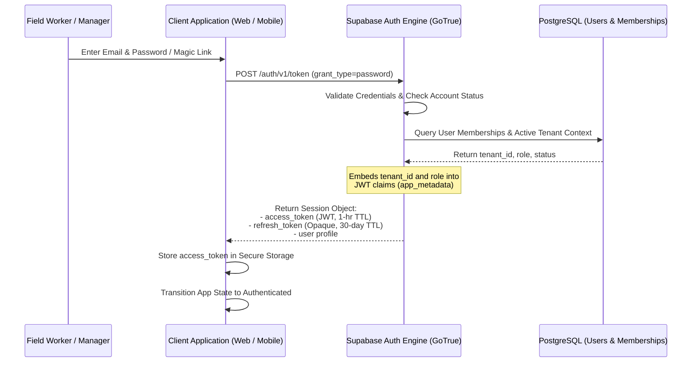

# FieldOps — Authentication Architecture & Session Lifecycle

---

## 1. Authentication Provider Strategy

FieldOps standardizes on **Supabase Auth (GoTrue)** as its core identity provider. Supabase Auth provides standards-compliant OAuth2 / JWT authentication, email magic links, secure password hashing (bcrypt/argon2), and seamless integration with PostgreSQL Row-Level Security.

---

## 2. Authentication Flow Diagram

---

## 3. Token Strategy & Expiration Lifecycles

| Token Type | Format | Lifetime | Storage Location | Renewal / Revocation Mechanism |
| :--- | :--- | :--- | :--- | :--- |
| **Access Token** | Signed JWT (RS256/HS256) | 60 minutes | Memory / Encrypted Cache | Automatically refreshed in background 5 minutes before expiration. |
| **Refresh Token**| Cryptographic Random String | 30 days | Web: Secure HTTP-Only Cookie Mobile: Hardware Keystore | Single-use rotation on each refresh; revoked immediately upon user logout. |
| **Service Role Key**| Static Master JWT | Permanent | Cloud KMS / Environment Variable | Strictly server-side; **never** exposed to client applications or repositories. |

---

## 4. Platform Session Behaviors

### 4.1. Web Management Console Session
- **Storage**: Tokens stored in browser memory with refresh token backed by `HttpOnly`, `SameSite=Lax`, `Secure` cookies.
- **Inactivity Timeout**: Configurable session timeout (default: 8 hours).
- **Tab Synchronization**: Session updates propagate across browser tabs via `BroadcastChannel`.

### 4.2. Mobile Field Client Session
- **Storage**: Tokens stored in device hardware security modules via `flutter_secure_storage` (Android Keystore / iOS Keychain).
- **Persistent Offline Session**: When a field technician loses cellular connectivity, the mobile client preserves their local session. Expiration of the access token does not lock the worker out of local task execution; token renewal occurs automatically when connectivity is restored.
- **Biometric Unlock (Future Phase)**: Fingerprint / Face ID unlock to resume session without re-entering passwords in the field.

---

## 5. Logout & Invalidation Protocols

1. **Client Cleanup**: Clears access token, refresh token, and local tenant caches from memory and secure storage.
2. **Server Revocation**: Invokes `POST /auth/v1/logout` to revoke the refresh token family on the server.
3. **Emergency Account Deactivation**: When an administrator deactivates an employee on the Web Console, the backend revokes all active session tokens immediately via database triggers.
