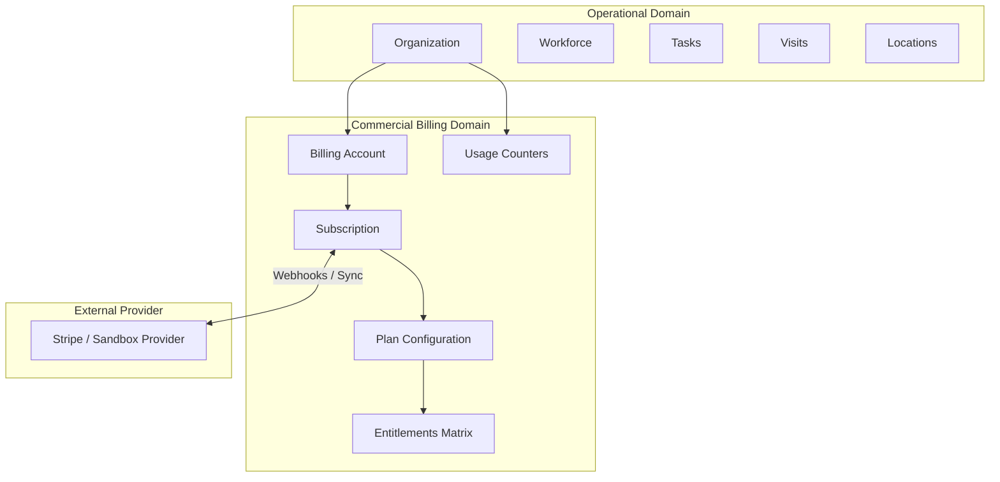

# SaaS Billing Architecture

## 1. Domain Separation & Conceptual Model

## 2. Source of Truth Principle
1. **Application Database**: The FieldOps database is the authoritative source of truth for organization entitlements, plan tiers, and usage limits.
2. **Provider Responsibilities**: The external billing provider is authoritative for processing payments, managing stored payment methods, calculating regional taxes, and emitting lifecycle events.
3. **No Per-Request External Calls**: Core application requests evaluate entitlements against cached/internal PostgreSQL subscription records without issuing external HTTP calls to the billing provider.
