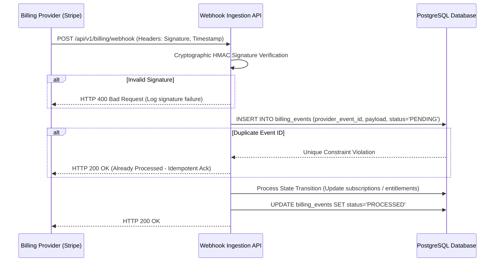

# Billing Webhook Processing & Idempotency

## 1. Webhook Lifecycle

Billing providers deliver event notifications asynchronously. Because network delivery is at-least-once, webhook handling must be strictly idempotent, replay-safe, and verifiable by cryptographic signature.

---

## 2. Ingested Event Types
- `checkout.session.completed`: Upgrades organization from Trialing/Free to active tier.
- `invoice.paid`: Renews subscription period (`current_period_start`, `current_period_end`), resets period counters.
- `invoice.payment_failed`: Transitions subscription to `PAST_DUE`, starts 14-day grace period.
- `customer.subscription.updated`: Reconciles plan tier or period-end cancellation flags.
- `customer.subscription.deleted`: Marks subscription `CANCELED`, sets entitlements to Free tier.
