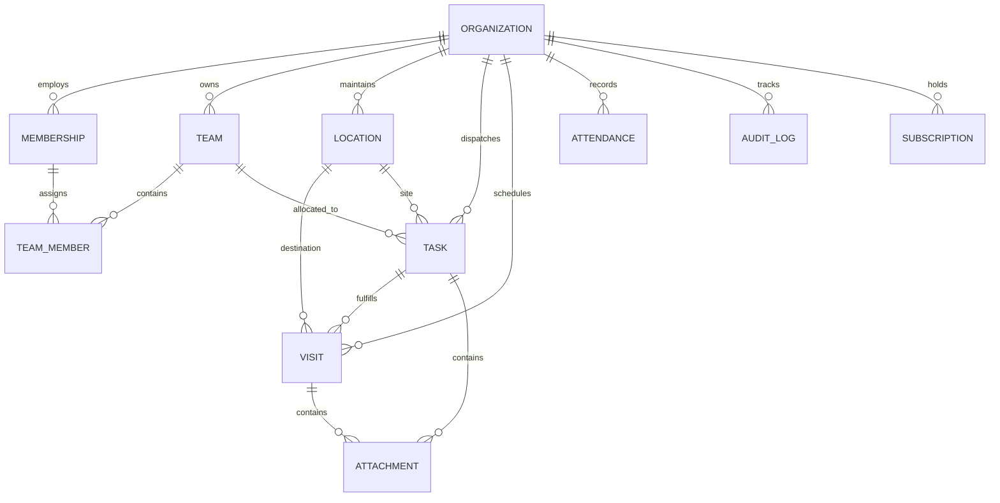
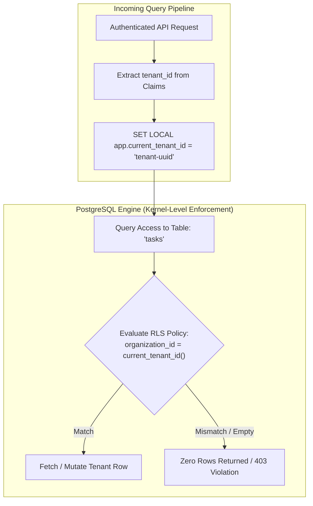

# FieldOps — Database Architecture & Tenancy Contract

---

## 1. Database Overview & Design Principles

FieldOps utilizes **PostgreSQL 15+** with the **PostGIS** spatial extension as its primary relational store. The database is architected for strict multi-tenant isolation, immutable auditability, and spatial query efficiency.

---

## 2. High-Level Domain Schema Blueprint

The FieldOps operational domain comprises twelve interrelated functional domains:



### Domain Descriptions
1. **Organization**: Multi-tenant root account (`organizations`).
2. **User & Membership**: Identity profile and tenant-specific role binding (`memberships`).
3. **Team**: Functional groups, territories, and supervisor assignments (`teams`, `team_members`).
4. **Location**: Physical customer sites with coordinates, addresses, and geofence radii (`locations`).
5. **Task**: Structured work package with checklists, status machine, and priorities (`tasks`).
6. **Visit**: Time-windowed scheduled appointment at a physical location (`visits`).
7. **Attendance**: Shift clock-in/out records with GPS verification (`attendance_records`).
8. **Attachment / Proof**: Photos, vector signatures, and reference documents (`proof_of_work`).
9. **Notification**: In-app and push notification dispatch records (`notifications`).
10. **Audit**: Immutable append-only log of sensitive security and operational mutations (`audit_logs`).
11. **Subscription**: SaaS billing entitlements, seat limits, and tier flags (`subscriptions`).

---

## 3. Database Conventions (Strict Standards)

All database migrations and schema definitions must conform strictly to these conventions:

| Attribute | Standard Convention | Example |
| :--- | :--- | :--- |
| **Casing** | `snake_case` strictly for table names, column names, triggers, and functions. | `organization_id`, `created_at` |
| **Pluralization** | Table names are always plural nouns. | `organizations`, `tasks`, `visits` |
| **Primary Keys** | `id UUID PRIMARY KEY DEFAULT gen_random_uuid()` (UUIDv7 or UUIDv4). | `id UUID PRIMARY KEY` |
| **Foreign Keys** | Singular entity name + `_id`, referencing parent primary key. | `organization_id REFERENCES organizations(id)` |
| **Timestamps** | `TIMESTAMPTZ` (Timestamp with Time Zone), stored strictly in UTC. | `created_at TIMESTAMPTZ NOT NULL DEFAULT NOW()` |
| **Updated Timestamps**| Maintained automatically via the `trigger_set_timestamp()` trigger. | `updated_at TIMESTAMPTZ NOT NULL DEFAULT NOW()` |
| **Soft Deletion** | Destructive business objects utilize nullable `deleted_at TIMESTAMPTZ`. | `deleted_at TIMESTAMPTZ NULL` |
| **Status Columns** | `VARCHAR(50)` constrained by `CHECK` or validated enums in uppercase. | `status VARCHAR(50) NOT NULL DEFAULT 'DRAFT'` |
| **JSON Usage** | `JSONB` for unstructured configurations, checklist arrays, or metadata. | `settings JSONB NOT NULL DEFAULT '{}'` |
| **Spatial Data** | PostGIS `GEOMETRY(Point, 4326)` or decimal degree floats (`lat`, `lng`). | `coordinates GEOGRAPHY(Point, 4326)` |

---

## 4. Multi-Tenant Isolation Model & RLS Architecture



### Multi-Tenancy Invariants
1. **Universal Discriminator**: Every tenant-owned table **must** include:
   `organization_id UUID NOT NULL REFERENCES organizations(id) ON DELETE CASCADE`
2. **Mandatory RLS Activation**:
   ```sql
   ALTER TABLE [table_name] ENABLE ROW LEVEL SECURITY;
   ALTER TABLE [table_name] FORCE ROW LEVEL SECURITY;
   ```
3. **No Sole Reliance on Application Filtering**: Application queries appending `WHERE organization_id = ...` provide defense in depth, but RLS guarantees that an accidental developer omission will **never** leak cross-tenant data.
4. **Immutable Audit Trail**: The `audit_logs` table has a database trigger that rejects any `UPDATE` or `DELETE` statement, ensuring unalterable legal accountability.
