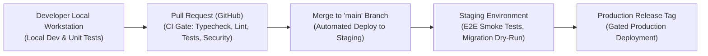

# FieldOps — Environments & Promotion Lifecycle

---

## 1. Environment Tiers

FieldOps maintains four strictly isolated environments:

| Environment | Purpose | Target Audience | Data Isolation |
| :--- | :--- | :--- | :--- |
| **Development (`development`)** | Local workstation engineering & testing | Developers, AI agents | Synthetic seed data (`seed.sql`) only. Runs locally on Docker/Supabase CLI. |
| **Test / CI (`test`)** | Automated pull request validation & CI runs | GitHub Actions | Ephemeral test databases spawned per run. |
| **Staging (`staging`)** | Pre-release validation & integration testing | Internal QA, Product leads | Anonymized synthetic data mirroring production scale. |
| **Production (`production`)** | Live multi-tenant SaaS operation | Paying SMB customers | Customer operational data with automated backups, encryption, and strict RLS. |

---

## 2. Promotion Pipeline

---

## 3. Environment Protection Rules

1. **Zero Production Leakage into Local Dev**: Local development builds are barred from connecting to production Supabase or PostgreSQL instances. Local configs default strictly to `http://127.0.0.1:54321`.
2. **Deterministic Seed Data**: Development databases must **never** load customer production dumps. Only synthetic test fixtures generated by `supabase/seed/seed.sql` are permitted in non-production environments.
3. **Secret Rotation**: Production encryption keys and Supabase credentials are managed in cloud secrets managers (e.g. AWS Secrets Manager, Doppler, or GitHub Secrets) and never written to disk or configuration repositories.
