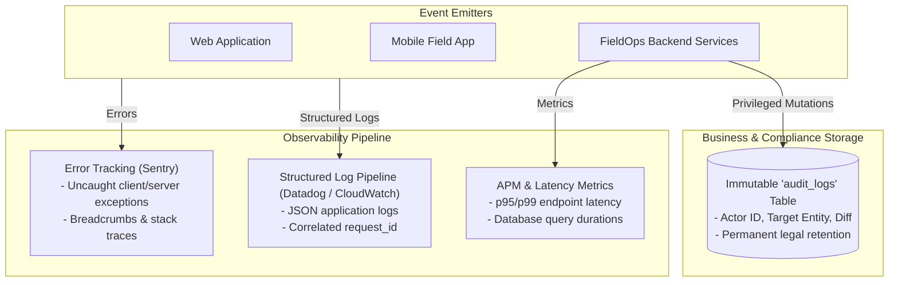

# FieldOps — Observability & Telemetry Architecture

---

## 1. Observability Overview

Observability in FieldOps is partitioned into distinct layers to serve two fundamentally different audiences:
1. **Engineering Telemetry**: Diagnosing technical failures, latency bottlenecks, and network anomalies.
2. **Business Auditability**: Providing enterprise administrators with an unshakeable, legally binding record of operational decisions.

> [!IMPORTANT]
> **Cardinal Rule**: Never mix technical logs with business audit logs.
> - Technical Log: *"PostgreSQL connection timeout on pool socket 4."* $\rightarrow$ Written to engineering telemetry.
> - Business Audit Event: *"Manager Elena reassigned Task TSK-104 from Worker Carlos to Worker David."* $\rightarrow$ Written to the immutable `audit_logs` database table.

---

## 2. Telemetry Architecture

---

## 3. Four Core Observability Pillars

### 3.1. Structured Application Logging
- Emits standardized JSON logs correlated by `x-request-id`, `organization_id`, and `user_id`.
- Used to trace individual request lifecycles across distributed services.

### 3.2. Error Tracking & Crash Reporting
- Captures uncaught exceptions on Web and Mobile (e.g. Sentry / Datadog Error Tracking).
- Strips personal identifiable information (PII) and credentials before dispatch.
- Provides symbolicated stack traces for Flutter mobile crashes.

### 3.3. Performance & Operational Metrics
- Tracks critical SLAs:
  - Mobile local write latency ($\le 80\text{ms}$).
  - API response duration p95 ($\le 200\text{ms}$).
  - Delta sync ingestion latency ($\le 500\text{ms}$).
  - Geofence calculation execution time ($\le 5\text{ms}$).

### 3.4. Immutable Business Audit Trail
- Stores every security and operational mutation:
  - Membership changes (invite, deactivate, role change).
  - Manual attendance modifications with mandatory rationale.
  - Geofence check-in exception overrides.
  - Bulk data exports.
