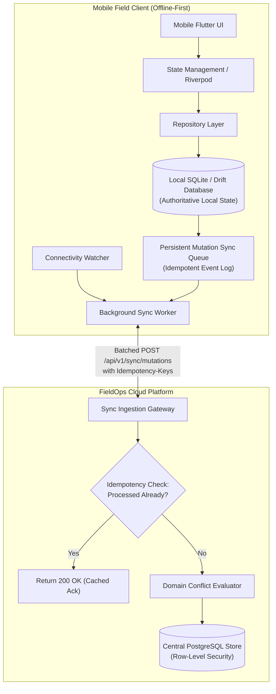

# FieldOps — Offline-First Architecture & Synchronization Protocol

---

## 1. Offline Philosophy & Operational Context

Field technicians routinely operate in basements, elevator shafts, rural utility substations, and reinforced concrete mechanical rooms with zero cellular coverage. In FieldOps, **offline operation is the baseline operating condition, not an exceptional error state**.

---

## 2. Mobile Offline Architecture Diagram



---

## 3. Event Identity & Idempotency Protocol

Every local mutation generated on a mobile device receives an immutable identity:
```typescript
interface MutationEnvelope<T = unknown> {
  mutation_id: string;       // Client-generated UUIDv7
  idempotency_key: string;   // sha256(user_id + entity_id + action + client_timestamp)
  entity_type: string;       // 'tasks' | 'visits' | 'attendance' | 'proof_of_work'
  entity_id: string;         // Target domain UUID
  action: string;            // 'CHECK_IN' | 'START_TASK' | 'COMPLETE_TASK'
  payload: T;                // Serialized mutation payload
  client_timestamp: string;  // ISO-8601 UTC timestamp of physical action
  retry_count: number;
  status: 'PENDING' | 'SYNCING' | 'SYNCED' | 'FAILED';
}
```

When network connectivity is restored:
1. `SyncWorker` dequeues mutations in strict chronological order (`client_timestamp ASC`).
2. Mutations are sent to the cloud in batches of up to 50 items with unique `Idempotency-Key` headers.
3. If the server has already committed the `idempotency_key`, it returns an immediate HTTP 200 acknowledgment without re-executing side effects, guaranteeing zero duplicate entries.

---

## 4. Domain-Specific Conflict Resolution Policies

A generic "Last-Write-Wins" (LWW) strategy is unsafe for field operations. FieldOps enforces tailored conflict policies per domain:

### 4.1. Task Status & Assignments
- **Policy**: **Server Authoritative with Immutable Proof Retention**.
- **Scenario**: An office manager cancels a task on the web dashboard while a field technician completes the task offline.
- **Resolution**: Upon reconnection, the task remains `CANCELED` on the server, but all worker-submitted checklist items, photos, and signatures are permanently retained in the audit log as historical evidence. The worker receives an informative notice: *"Task was canceled by dispatch; your completed proof has been archived."*

### 4.2. Shift Attendance
- **Policy**: **Monotonic Append-Only Event Log**.
- **Scenario**: A technician clocks in offline at 08:00 AM, clocks out at 04:30 PM, and reconnects at 05:00 PM.
- **Resolution**: Both events are committed sequentially based on their recorded physical timestamps and GPS fixes. The server never overwrites or recalculates the worker's asserted on-site presence time.

### 4.3. Proof of Work & Checklists
- **Policy**: **Client Append-Only**.
- **Scenario**: Photos and checklists submitted from the field.
- **Resolution**: Proof items have client-generated UUIDs. The server appends proof items to the task/visit record; it never overwrites existing items.

---

## 5. Network Retry & Backoff Strategy

Transient network dropouts trigger exponential backoff with randomized jitter to prevent thundering-herd spikes on API servers:

$$t_{\text{wait}} = \min(t_{\text{max}}, 2^{\text{attempt}} \times t_{\text{base}} + \text{rand}(0, 1000)\text{ms})$$
- $t_{\text{base}} = 200\text{ms}$
- $t_{\text{max}} = 30\text{ seconds}$
- After 5 consecutive failures, the sync worker pauses polling and waits for an OS network state change notification.
