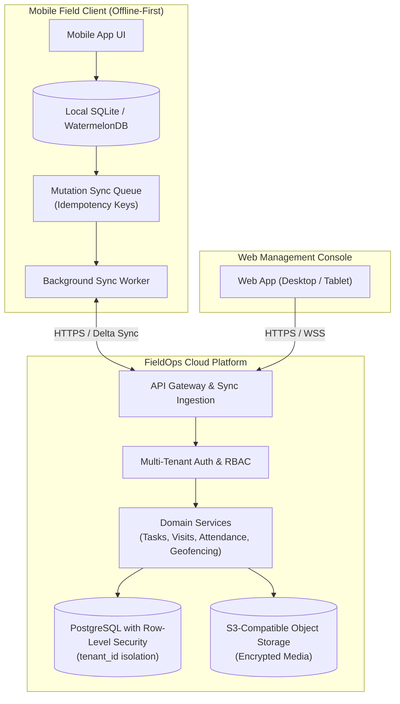

# FieldOps — Phase 01 Architecture Principles

---

## 1. Architectural Philosophy

FieldOps is architected as an **offline-first, multi-tenant distributed operations system**. Unlike standard CRUD applications that assume persistent high-speed internet, FieldOps treats intermittent connectivity, physical mobility, and device restarts as standard operating conditions.

---

## 2. Principle 1: Multi-Tenancy & Partitioning by Design

1. **Shared Database, Isolated Rows**: FieldOps employs a shared-database, shared-schema multi-tenant model enforced by PostgreSQL **Row-Level Security (RLS)**.
2. **Universal Discriminator**: Every tenant-owned table (`users`, `teams`, `tasks`, `visits`, `attendance_records`, `locations`, `proof_of_work`, `audit_logs`) includes a non-nullable `organization_id UUID` column indexed with foreign key cascading.
3. **Defense in Depth**:
   - Application Layer: Every API request extracts and verifies the tenant context from the verified JWT token claims before invoking service methods.
   - Database Layer: RLS policies (`CREATE POLICY tenant_isolation_policy ON ... USING (organization_id = current_setting('app.current_tenant_id')::uuid)`) guarantee zero leakage even if an application bug omits a `WHERE` clause.
4. **Storage Namespacing**: Media attachments and proof-of-work files are isolated in cloud object storage via paths prefixed by tenant:
   `s3://fieldops-proofs/{organization_id}/{year}/{month}/{task_or_visit_id}/{file_id}.jpg`
   Direct public access is prohibited; clients access media via short-lived (15-minute) pre-signed URLs verified against user permissions.

---

## 3. Principle 2: Offline-First Synchronization Protocol

Field workers must never experience blocking network spinners or lost data when performing physical work.

### 3.1. Local Storage Engine
- Mobile clients embed a durable local database (e.g. SQLite / Room / CoreData / WatermelonDB).
- All reads query local storage directly ($\le 10\text{ms}$ response).
- All writes execute against local storage inside an atomic transaction, simultaneously recording an entry in the local `pending_mutations` queue.

### 3.2. Idempotent Mutation Queue
Every local mutation records:
- `mutation_id`: Globally unique identifier (UUIDv4) generated on the client.
- `idempotency_key`: Hash of `(user_id, client_timestamp, entity_id, action)`.
- `entity_type`: String (`tasks`, `visits`, `attendance_records`, `proof_of_work`).
- `entity_id`: UUID of the affected domain object.
- `action`: String (`CLOCK_IN`, `START_TASK`, `SUBMIT_CHECKLIST`, `CHECK_IN`, `COMPLETE_TASK`).
- `payload`: JSON serialized mutation data.
- `client_timestamp`: UTC ISO 8601 timestamp of when the physical action occurred.
- `sync_status`: Enum (`PENDING`, `SYNCING`, `SYNCED`, `FAILED`).
- `retry_count`: Integer (tracks backoff attempts).

### 3.3. Synchronization Ingestion & Conflict Resolution
When network connectivity is established:
1. The background sync worker sends mutations to `POST /api/v1/sync/mutations` in batches of up to 50 items.
2. The server verifies the `idempotency_key`:
   - If already processed: Server returns the previous HTTP 200 acknowledgment without re-executing side effects (deduplication guarantee).
   - If new: Server executes the state transition within the tenant's transaction scope.
3. **Conflict Rules**:
   - **Checklists & Photos**: Append-only. Server merges checklist updates; photos with unique client UUIDs are permanently recorded.
   - **Task Status Conflicts**: If an administrator canceled a task on the web console while the worker completed it offline, the server marks the task `CANCELED` but commits all worker-captured proofs to the audit log as historical evidence.
4. **Exponential Backoff**: Transient network or 5xx server errors trigger exponential backoff with randomized jitter ($t = 2^n + \text{rand}(0, 1000)\text{ms}$) to prevent hammering the API upon regaining cell coverage.

---

## 4. Principle 3: Geospatial Verification & Battery Discipline

### 4.1. Point-in-Time Geofence Engine
- To respect field worker privacy and preserve smartphone battery life throughout an 8-to-12 hour shift, **continuous background GPS streaming is NOT the default**.
- High-accuracy GPS location is sampled deterministically upon:
  1. Shift Clock-In / Clock-Out
  2. Visit Check-In / Check-Out
  3. Task Status transitions (`IN_PROGRESS`, `BLOCKED`, `COMPLETED`)
  4. Photo capture (EXIF location tagging)

### 4.2. Distance Calculation Standard
Geodesic distance between the client coordinate and customer site is computed via the Great-Circle Haversine formula:
$$d = 2R \cdot \arcsin\left(\sqrt{\sin^2\left(\frac{\Delta \phi}{2}\right) + \cos(\phi_1)\cos(\phi_2)\sin^2\left(\frac{\Delta \lambda}{2}\right)}\right)$$
- If $d \le \text{allowed\_radius\_meters}$ (default: 100m): Result is `VALID`.
- If $d > \text{allowed\_radius\_meters}$: Result is `LOCATION_EXCEPTION`.
- Check-in is permitted to proceed, preserving operational flow, but flagged on manager dashboards and written to the immutable audit log.

---

## 5. Principle 4: Immutable Audit Logging

Every state transition, geofence exception, manual attendance adjustment, and privileged role change produces an append-only audit event:
- Stored in a partitioned, immutable database table.
- Contains: `actor_id`, `organization_id`, `action`, `entity_type`, `entity_id`, `before_state`, `after_state`, `ip_address`, and `created_at`.
- Direct `UPDATE` or `DELETE` statements on `audit_logs` are forbidden at the database trigger level.
