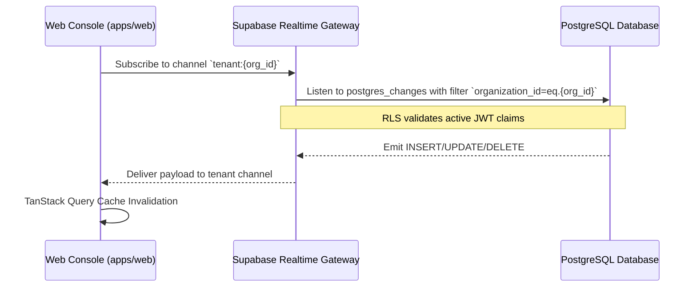

# Realtime Operational Updates Architecture

## 1. Overview & Objective

To provide operational situational awareness without aggressive or battery-draining HTTP polling, the FieldOps Web Console implements tenant-scoped Realtime subscriptions.

---

## 2. Subscription Scope & Tenant Partitioning

Realtime events use Supabase Realtime channels configured with PostgreSQL Row-Level Security (RLS) and client-side filter parameters.

### Table Subscriptions
The Web Operations Console listens on the following tables within the active tenant:
1. `tasks`: Updates task status, assignments, or due dates.
2. `visits`: Updates visit status, check-in timestamps, and exception flags.
3. `attendance_records`: Updates field worker clock-in/out states and shift adjustments.
4. `worker_activities`: Streams live operational ledger entries.

---

## 3. Reconnection & Stale Data Prevention

1. **Reconnection Recovery**: Upon network disconnect and reconnect, the client automatically triggers a soft refetch of active queries rather than replaying missed events, ensuring complete consistency with server state.
2. **Component Lifecycle Teardown**: Subscriptions are tied to component mount lifecycles via `useEffect`. Upon unmount or switching organizations, channels are unsubscribed immediately to prevent memory leaks and cross-tenant pollution.
