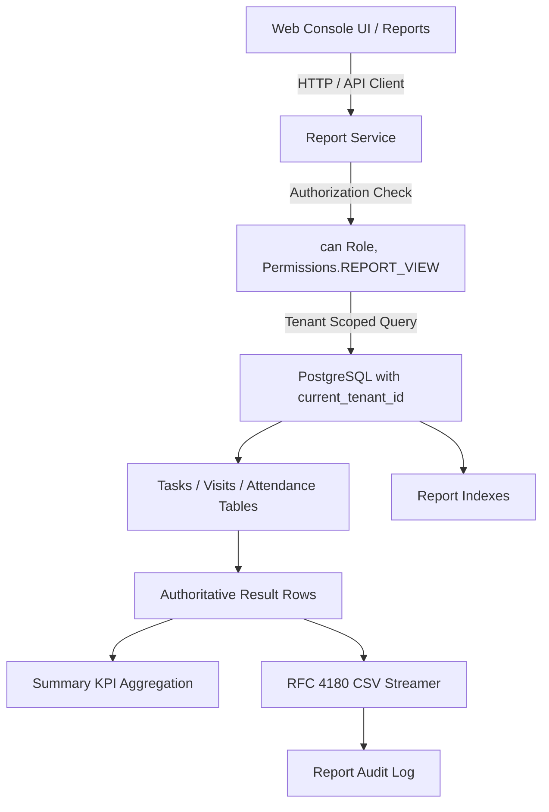

# Operational Reporting Architecture

## 1. Architectural Strategy

The reporting layer sits cleanly above the operational domain, consuming authoritative entities without modifying operational tables.

## 2. Server-Side Pagination & Query Boundaries
1. **Pagination**: Reporting tables paginate results server-side with default `pageSize = 50` and maximum `pageSize = 100`.
2. **Date Window Limit**: Synchronous report generation is bounded to a maximum window of 90 days. Requests exceeding 90 days return `REPORT_RANGE_TOO_LARGE`.
3. **Data Minimization (ADR-0024)**: Standard reports exclude raw coordinates. GPS verification results (`VALID`, `OUTSIDE_RADIUS`, `LOW_ACCURACY`) convey operational compliance while protecting worker physical privacy.
