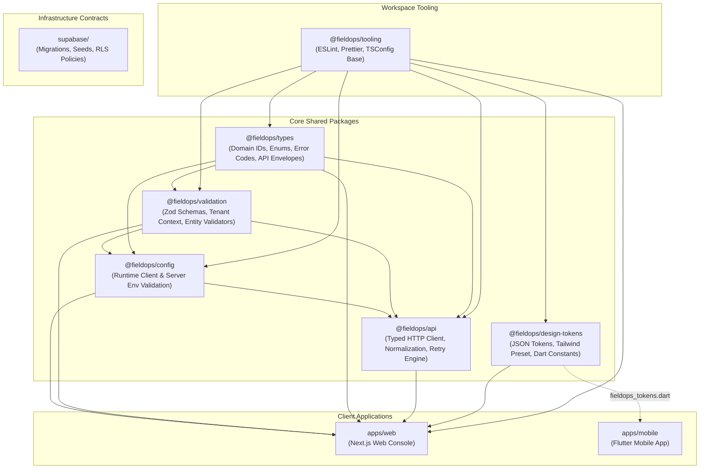

# FieldOps — Repository Structure & Monorepo Graph

---

## 1. Monorepo Organization

FieldOps is organized as a unified monorepo managed via **pnpm workspaces** and orchestrated by **Turborepo**. The monorepo unites web frontends, mobile client code, shared TypeScript libraries, and database migration contracts in a single version-controlled repository.

---

## 2. Workspace Dependency Graph



---

## 3. Directory Layout Specification

```
fieldops/
├── apps/
│   ├── web/                    # Next.js 14 Web Management Console
│   └── mobile/                 # Flutter 3.24+ Mobile Field Application
│
├── packages/
│   ├── types/                  # Authoritative TypeScript types and branded primitives
│   ├── validation/             # Zod validation schemas for all domain envelopes
│   ├── config/                 # Environment validation with strict client/server isolation
│   ├── design-tokens/          # Single source of truth design tokens (JSON, CSS, Tailwind, Dart)
│   ├── api/                    # Typed API client with request ID, retry, and error normalization
│   └── tooling/                # Shared base configurations for ESLint, Prettier, and TypeScript
│
├── supabase/
│   ├── migrations/             # Version-controlled SQL migrations with RLS policies
│   ├── seed/                   # Deterministic synthetic seed data for local development
│   ├── config/                 # Local Supabase CLI configuration
│   └── functions/              # Edge function handlers (Phase 04+)
│
├── docs/                       # Comprehensive architectural and product documentation
│   ├── product/                # PRD, Scope, Roles, Personas, User Stories, Flows
│   ├── brand/                  # Brand strategy, Naming, Visual direction, Assets
│   ├── design/                 # UX principles, Design tokens, Typography, Components
│   ├── architecture/           # System, Database, API, Auth, Offline, ADRs
│   ├── deployment/             # Local dev, Staging, Production, CI/CD runbooks
│   ├── security/               # Security baselines, Secret management, Privacy
│   └── testing/                # Quality model, Test pyramid, Validation reports
│
├── .github/
│   └── workflows/              # GitHub Actions CI/CD pipelines
│
├── AGENTS.md                   # AI Coding Agent binding governance rules
├── README.md                   # Repository overview and onboarding guide
├── pnpm-workspace.yaml         # Monorepo workspace definition
├── turbo.json                  # Turborepo task pipeline configuration
├── tsconfig.json               # Root TypeScript configuration
├── package.json                # Root scripts and workspace dependencies
└── .env.example                # Canonical environment variable template
```
