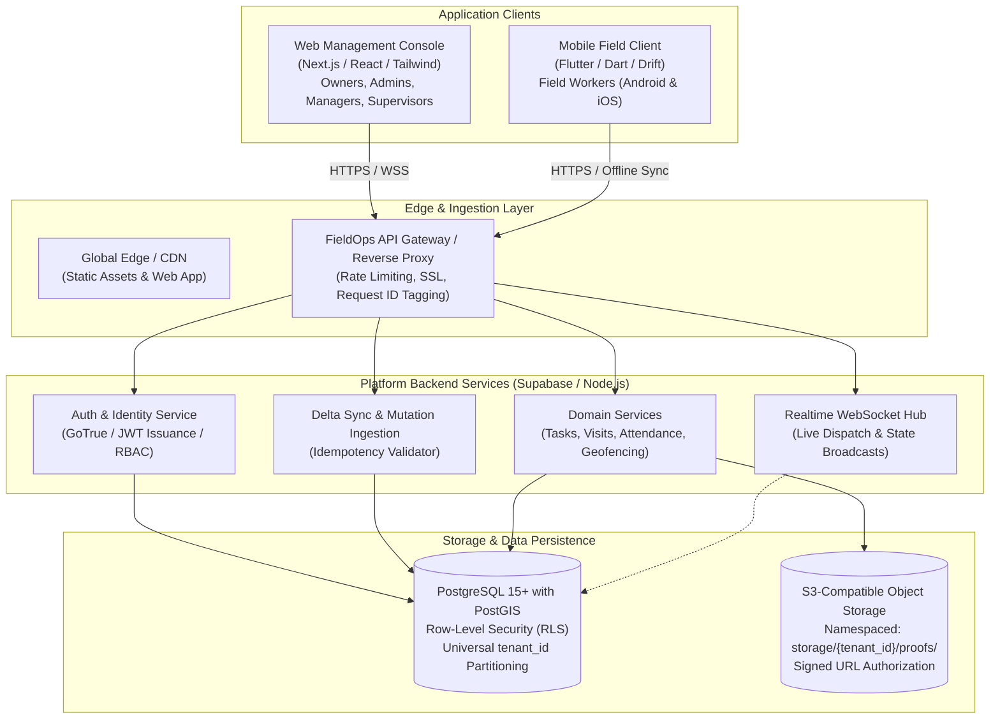

# FieldOps — System Architecture Specification

---

## 1. System Overview

FieldOps is architected as an **offline-resilient, multi-tenant distributed operations platform**. The system harmonizes back-office administrative oversight with high-reliability mobile execution in disconnected physical environments.

---

## 2. High-Level System Architecture Diagram



---

## 3. End-to-End Request Flow Architecture

Every operational request across web and mobile traverses a strict, multi-stage processing pipeline:

```mermaid
sequenceDiagram
    participant Client as Client Application (Web / Mobile)
    participant Gateway as API Gateway / Proxy
    participant Auth as Auth & RBAC Middleware
    participant Service as Domain Service Layer
    participant RLS as PostgreSQL (Row-Level Security)
    participant Audit as Immutable Audit Log

    Client->>Gateway: HTTP Request (Method, Path, Payload, x-request-id)
    Note over Gateway: Injects / verifies x-request-id<br/>Enforces IP Rate Limiting
    Gateway->>Auth: Extract JWT & x-tenant-id
    Auth->>Auth: Cryptographically verify JWT<br/>Validate Membership & Role Permissions
    
    alt Unauthorized or Mismatched Tenant
        Auth-->>Client: 401 Unauthorized / 403 Forbidden
    else Valid Tenant Context
        Auth->>Service: Execute Command with Verified TenantContext
        Service->>Service: Validate Payload via Zod Schemas
        Service->>RLS: BEGIN Transaction; SET LOCAL app.current_tenant_id = :tenant_id
        RLS->>RLS: Evaluate RLS Policies (Kernel Isolation)
        RLS-->>Service: Mutation Result Committed
        
        opt Sensitive Operational Action
            Service->>Audit: Append Audit Record (Actor, Action, Diff, Timestamp)
        end
        
        Service-->>Client: 200 OK (Standardized { success: true, data: T, meta: {} })
    end
```

---

## 4. Architectural Quality Attributes

1. **Deterministic Multi-Tenancy**: Data boundaries are enforced at the database engine level via PostgreSQL Row-Level Security (`app.current_tenant_id`). Application code cannot bypass tenant scoping.
2. **Offline-First Durability**: Mobile clients persist every mutation locally before acknowledging completion to the user. Background workers synchronize mutations using deterministic idempotency keys.
3. **Decoupled Monorepo Structure**: Shared packages (`@fieldops/types`, `@fieldops/validation`, `@fieldops/config`, `@fieldops/design-tokens`, `@fieldops/api`) define contracts; applications (`apps/web`, `apps/mobile`) consume them without circular coupling.
4. **Observable & Traceable**: Every transaction propagates a unique `x-request-id` from the client through edge routers, application logs, and database audit entries.
