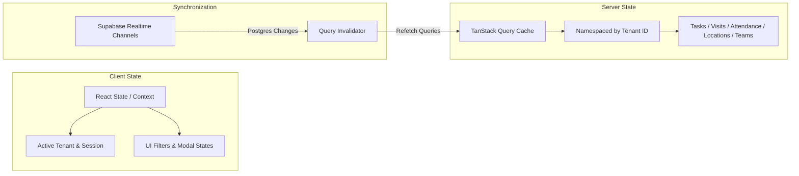

# Web Operations Console Architecture

## 1. Architectural Strategy

The FieldOps Web Operations Console is built within `apps/web` utilizing Next.js App Router, React 18, Tailwind CSS, TanStack Query, and TypeScript. It strictly interfaces with shared packages:
- `@fieldops/api`: Typed REST services with token & tenant injection, retry backoff, and error normalization.
- `@fieldops/types`: Authoritative state machines, models, permissions matrix, and utility functions.
- `@fieldops/validation`: Zod schemas for all client-side form validations.
- `@fieldops/design-tokens`: Shared theme variables, spacing tokens, and color semantics.

Direct access to PostgreSQL or privileged service role keys from `apps/web` is strictly prohibited.

---

## 2. State Management Architecture



### Cache Partitioning Rule
All queries cached in TanStack Query must prefix their `queryKey` with the active `organizationId`:
```ts
['organization', organizationId, 'tasks', { ...filters }]
['organization', organizationId, 'visits', { ...filters }]
['organization', organizationId, 'attendance', { date }]
```
Upon tenant context switch, `queryClient.removeQueries({ predicate: (q) => q.queryKey[0] === 'organization' })` is executed to prevent stale cross-tenant leakage in browser memory.

---

## 3. Responsive & Accessible UI Guidelines

1. **Information Density**: Operations consoles prioritize high signal-to-noise ratio. Compact tables, clear status pills, monospace IDs/durations, and subtle divider borders.
2. **Keyboard Navigation & ARIA**:
   - Modals use trap-focus, `aria-modal="true"`, and escape-key dismissal.
   - Map features include an accessible Table/List alternative toggle for screen readers and high-contrast operational environments.
3. **Empty, Loading & Error States**:
   - Loading spinners or skeleton rows during async queries.
   - Clean empty states explaining next actionable steps (e.g. "No visits scheduled for today. Click '+ Schedule Visit'").
   - Detailed user-friendly error banners with normalized error messages and request tracing IDs.
