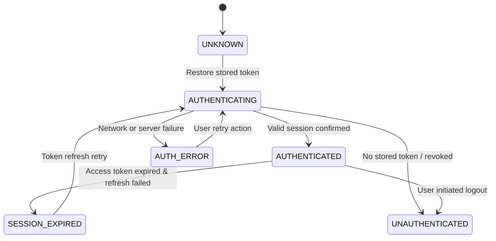
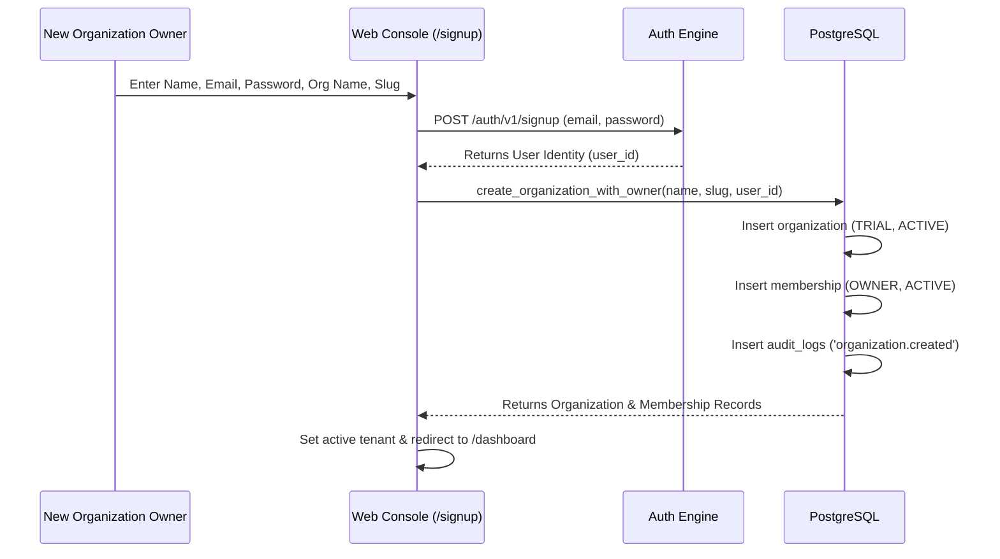

# FieldOps — Authentication Flow & Architecture

---

## 1. Overview

FieldOps standardizes on **Supabase Auth (GoTrue)** as its core identity provider, coupled with PostgreSQL Row-Level Security and custom application-level session managers.

Authentication credentials (passwords, tokens, verification secrets) are kept strictly segregated from business data entities. The application database never stores plaintext passwords or encryption keys.

---

## 2. Universal 6-State Auth Lifecycle

Both the Web Application and Mobile Application implement the identical deterministic state machine:

### State Definitions
1. **`UNKNOWN`**: Initial cold-start state prior to evaluating local secure storage or cookies.
2. **`AUTHENTICATING`**: In-flight token verification or login credential exchange.
3. **`AUTHENTICATED`**: Valid access token active; user profile and active tenant membership loaded.
4. **`UNAUTHENTICATED`**: No credentials present; user is routed to public login or signup screens.
5. **`SESSION_EXPIRED`**: Token TTL elapsed and refresh failed; prompts re-authentication without data loss.
6. **`AUTH_ERROR`**: Credential mismatch, account locked, or unrecoverable auth error with human-readable diagnostic.

---

## 3. Web vs. Mobile Authentication Comparison

| Attribute | Web Management Console | Mobile Field Client |
| :--- | :--- | :--- |
| **Runtime** | Next.js 14 App Router (Node.js + Edge) | Flutter 3.24+ (Dart) |
| **Token Storage** | Memory + `SameSite=Lax` Secure Cookies | Platform Hardware Keystore (`SecureStorageContract`) |
| **Route Protection** | Edge Middleware (`src/middleware.ts`) | Declarative GoRouter Redirect Guards |
| **Offline Resilience** | Browser online required | Local session preserved through cellular dropouts |
| **Tenant Switching** | Dynamic switcher with Query Cache purge | Modal list with local storage persistence |

---

## 4. Multi-Tenant Onboarding Sequence

