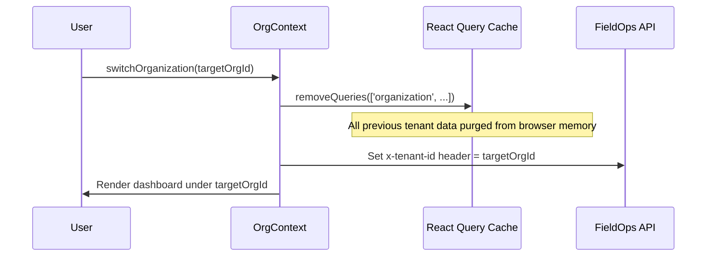

# FieldOps — Organization Context & Multi-Tenancy Architecture

---

## 1. Tenant Boundary Rule

The primary security boundary in FieldOps is the **Organization** (`tenant_id`).

Every query, mutation, storage object, and cache key must be partitioned by Organization ID. An account that belongs to multiple tenants must operate within a single, explicitly selected Organization context at any given time.

---

## 2. Organization Switching Flow

When a user switches organizations:

1. **Context Update**: `activeMembership` in `AuthContext` is switched to the target organization's membership.
2. **Cookie Synchronization**: `fieldops_active_org_id` cookie is updated to ensure middleware and edge requests route correctly.
3. **HTTP Client Header**: All subsequent API calls automatically inject `x-tenant-id: <new_org_id>`.
4. **Cache Invalidation**: Query cache removes all queries matching `['organization', ...]`, ensuring zero data cross-bleeding.

