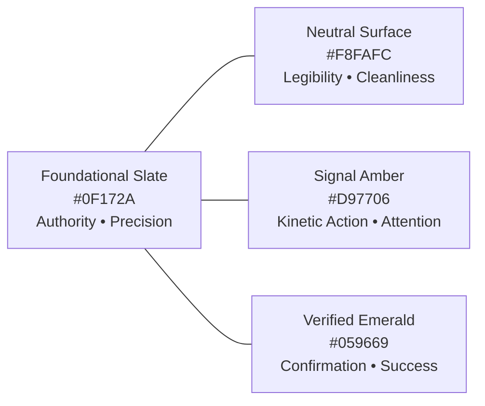

# FieldOps — Visual Direction & Brand Aesthetics

---

## 1. Visual Philosophy: "Industrial Ergonomics"

FieldOps visual design is inspired by high-reliability industrial equipment, aviation avionics, and high-performance dispatch consoles. It balances modern digital SaaS aesthetics with the utilitarian demands of field environments.

### Core Visual Principles
1. **Radical Contrast Over Subtle Tints**: In bright sunlight or glare, subtle grey-on-grey interfaces disappear. We employ deep slate tones against high-luminance backgrounds and bold, unambiguous status pills.
2. **Utilitarian Elegance**: Clean lines, generous whitespace around interactive touchpoints, and dense, structured data grids for managers.
3. **Information Density with Hierarchy**: Web management consoles provide rich situational awareness at a glance; mobile screens ruthlessly reduce visual clutter to the single next action.

---

## 2. Color Direction & Chromatic Intent

FieldOps avoids whimsical consumer palettes in favor of purposeful, operationally grounded colors.

### 2.1. Brand Core Colors
- **Foundational Primary — Slate 900 (`#0F172A`)**: Represents solidity, structural durability, and modern engineering. Serves as our primary brand anchor, header background, and typography foundation.
- **Brand Accent — Electric Signal Amber (`#D97706` / `#F59E0B`)**: Inspired by industrial safety signage and alert beacons. Used sparingly for primary calls-to-action ("Check In", "Start Task") and urgent operational highlights.
- **Clean Canvas — Polar White & Slate 50 (`#FFFFFF` / `#F8FAFC`)**: Ultra-clean, low-eye-strain backgrounds that maximize contrast and outdoor screen readability.

### 2.2. Semantic Operational Palette
Status colors are non-negotiable semantic indicators:
- **Verified / On Duty — Emerald 600 (`#059669`)**: Indicates valid geofenced presence, completed tasks, and active clock-in.
- **Operational Exception / Caution — Amber 600 (`#D97706`)**: Flags check-ins outside the allowed radius, approaching SLA deadlines, and low battery.
- **Blocked / Critical Alarm — Rose 600 (`#E11D48`)**: Denotes blocked tasks, overdue appointments, and failed sync events.
- **Informational / En Route — Sky 600 (`#0284C7`)**: Indicates active transit, assigned work, and system notifications.

---

## 3. Imagery and Art Direction

### Authentic Photography Guidelines
- **Real Working Conditions**: Showcase technicians in genuine environments—rooftop HVAC units, mechanical equipment rooms, commercial electrical panels, telecommunication towers, logistics bays.
- **Genuine Equipment**: Workers wearing appropriate personal protective equipment (PPE), high-visibility vests, work gloves, and carrying real tools.
- **Natural Lighting**: Authentic natural light, direct sunlight, or headlamp illumination; avoid stylized neon studio lighting or unrealistic fashion lighting.
- **No Staged Perfection**: Avoid images of models posing unnaturally with immaculate hard hats or spotless white gloves holding pristine, blank clipboards.

### Graphical & Illustrative Standards
- **Technical Precision Diagrams**: When illustrating concepts (e.g. geofencing or sync pipelines), use clean isometric or orthogonal vector diagrams.
- **Zero AI Artifacts**: Strictly reject generic AI-generated imagery featuring surreal lighting, distorted hands, or fantasy sci-fi interfaces.
- **Functional Icons**: Use sharp, geometrically balanced icons (e.g., Lucide, Heroicons, or bespoke SVG) with consistent 2px stroke weights.

---

## 4. UI Ergonomics: Web vs. Mobile

| Attribute | Web Management Console | Mobile Field Application |
| :--- | :--- | :--- |
| **Primary Context** | Multi-monitor desk or laptop; mouse/keyboard; multi-tasking. | One-handed smartphone usage; direct sunlight; work gloves; motion. |
| **Information Density** | High density; tabular data grids; multi-pane dispatch board. | Focused density; card-based; single focal point per screen. |
| **Touch Targets** | 32px – 40px clickable elements. | Minimum 48px – 56px primary tap targets; generous padding. |
| **Color Treatment** | Subtle neutral borders (`#E2E8F0`), muted headers, rich data accents. | High-contrast borders, bold status badges, large tap-to-action buttons. |
| **Elevation & Depth** | Subtle layered elevation (`box-shadow: 0 1px 3px rgba(0,0,0,0.1)`). | Flat or crisp card elevation with high-contrast dividing borders. |
