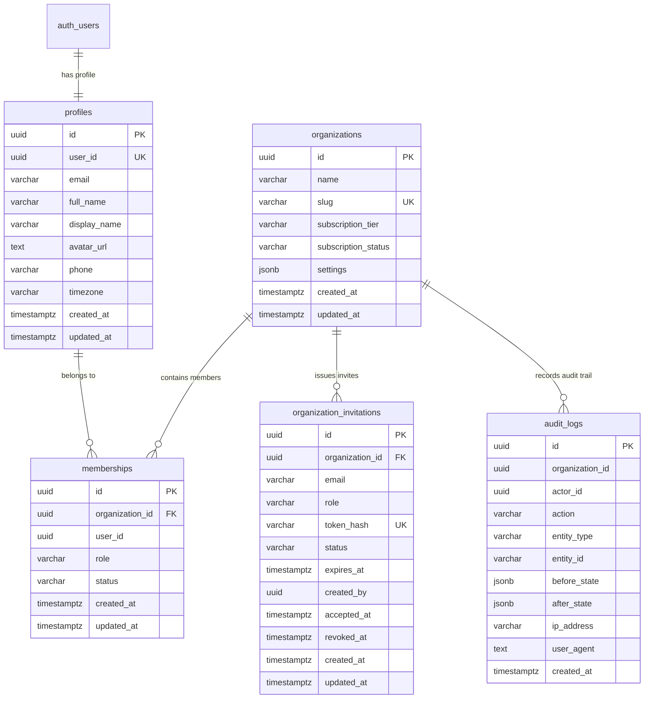

# FieldOps — Database Schema Contract: Phase 03 Identity & Access Control

---

## 1. Schema Diagram

---

## 2. Table Specifications

### 2.1. `profiles`
- Primary Key: `id UUID DEFAULT gen_random_uuid()`
- Unique: `user_id UUID NOT NULL UNIQUE`
- Indices: `idx_profiles_user_id`, `idx_profiles_email`
- Row-Level Security: Enabled and forced.

### 2.2. `organizations`
- Primary Key: `id UUID DEFAULT gen_random_uuid()`
- Unique: `slug VARCHAR(100) NOT NULL UNIQUE`
- Slug Check Constraint: `slug ~ '^[a-z0-9]+(-[a-z0-9]+)*$' AND length(slug) >= 3 AND length(slug) <= 63`
- Row-Level Security: Enabled and forced.

### 2.3. `memberships`
- Primary Key: `id UUID DEFAULT gen_random_uuid()`
- Foreign Key: `organization_id UUID REFERENCES organizations(id) ON DELETE CASCADE`
- Unique: `UNIQUE (organization_id, user_id)`
- Role Check Constraint: `role IN ('OWNER', 'ADMIN', 'MANAGER', 'SUPERVISOR', 'FIELD_WORKER')`
- Status Check Constraint: `status IN ('INVITED', 'ACTIVE', 'SUSPENDED', 'REMOVED')`
- Indices: `idx_memberships_tenant_user`, `idx_memberships_user_status`
- Row-Level Security: Enabled and forced.
- Protection Trigger: `trg_prevent_last_owner_removal`

### 2.4. `organization_invitations`
- Primary Key: `id UUID DEFAULT gen_random_uuid()`
- Foreign Key: `organization_id UUID REFERENCES organizations(id) ON DELETE CASCADE`
- Unique: `token_hash VARCHAR(64) UNIQUE`
- Role Check: `role IN ('OWNER', 'ADMIN', 'MANAGER', 'SUPERVISOR', 'FIELD_WORKER')`
- Status Check: `status IN ('PENDING', 'ACCEPTED', 'EXPIRED', 'REVOKED')`
- Indices: `idx_invitations_tenant_email`, `idx_invitations_token_hash`
- Row-Level Security: Enabled and forced.
