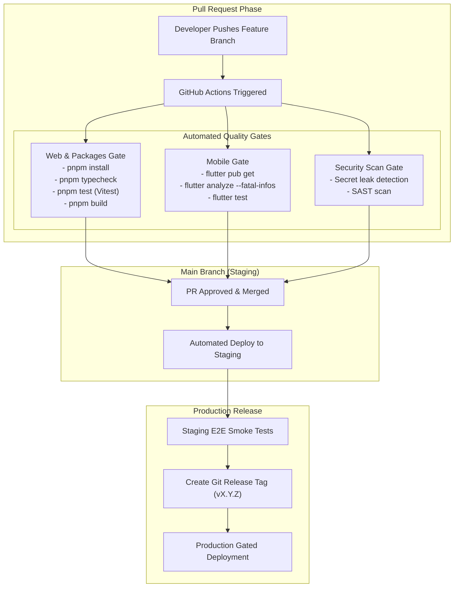

# FieldOps — CI/CD Pipeline & Quality Automation

---

## 1. CI/CD Architecture Flow

---

## 2. Non-Negotiable CI Rules

1. **Zero Warnings as Errors**: TypeScript compiler errors, ESLint errors, and Flutter analysis warnings must cause the CI pipeline to fail.
2. **Never Bypass CI**: Merging code with failing checks or bypassing branch protection is strictly prohibited.
3. **Reproducible Builds**: All builds utilize frozen lockfiles (`pnpm-lock.yaml`) and pinned SDK versions.
