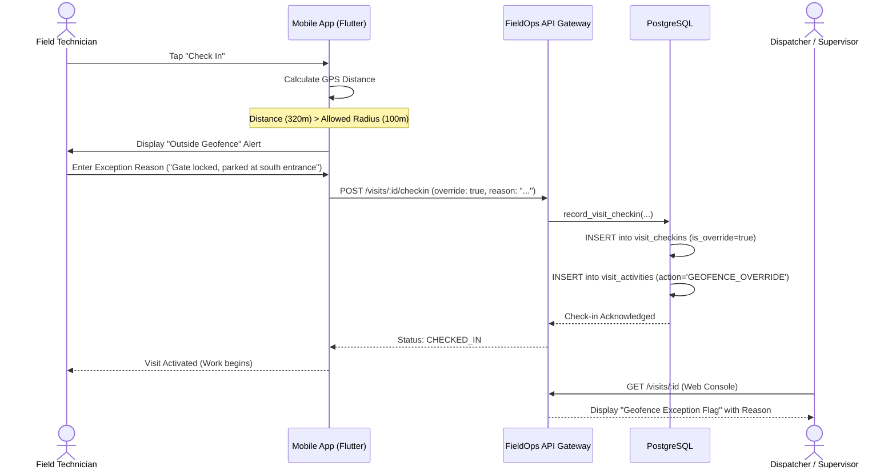

# Geofence Exceptions & Override Workflow Specification

## 1. Executive Summary

In real-world field operations, technicians frequently encounter situations preventing them from standing directly within the predetermined geofence radius. Examples include locked perimeter gates, construction roadblocks, lack of on-site parking requiring parking three blocks away, or inaccurate client street addresses.

FieldOps provides a resilient **Geofence Exception Flow** that prevents operational standstills while preserving accountability and audit integrity.

---

## 2. The Exception Workflow

---

## 3. Mandatory Reason Enforcement

1. **Client-Side Validation**: If the technician is outside the geofence radius, the **Check In** button requires non-empty text in the Exception Reason field.
2. **Server-Side Assertion**: If coordinates exceed `allowed_radius_meters`, `record_visit_checkin` will fail unless `override_reason IS NOT NULL AND length(trim(override_reason)) >= 5`.
3. **Supervisor Notification**: Visits completed under an exception override are visibly flagged in dispatcher lists with an amber warning badge (`EXCEPTION_FLAGGED`), alerting supervisors to review site access conditions or update inaccurate location coordinates.

---

## 4. Location Correction Loop

If multiple technicians repeatedly report geofence exceptions for a specific site (e.g., "Customer entrance moved to rear building"), supervisors with `LOCATION_MANAGE` permissions can update the location's latitude, longitude, or `allowed_radius_meters` directly from the Web console.
