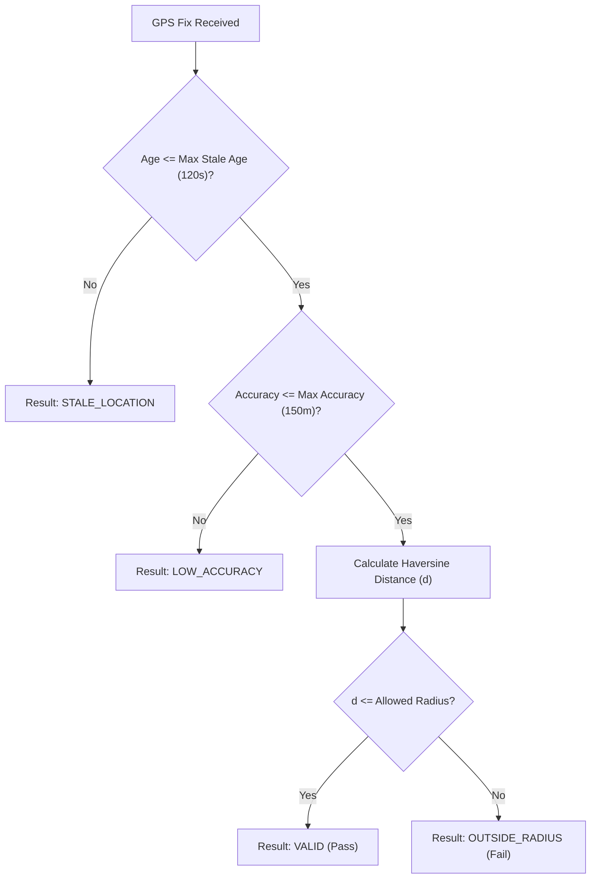

# GPS Verification & Haversine Distance Engine

## 1. Overview

FieldOps verifies physical worker presence at assigned job sites using point-in-time GPS capture evaluated against the target location's defined circular geofence. The system uses the spherical Haversine formula across the database (PostgreSQL), web application (TypeScript), and mobile client (Flutter/Dart).

---

## 2. Mathematical Definition: The Haversine Formula

The great-circle distance $d$ between two points $(\phi_1, \lambda_1)$ and $(\phi_2, \lambda_2)$ in radians on a sphere of radius $R = 6,371,000$ meters is calculated as:

$$\Delta \phi = \phi_2 - \phi_1$$
$$\Delta \lambda = \lambda_2 - \lambda_1$$
$$a = \sin^2\left(\frac{\Delta \phi}{2}\right) + \cos(\phi_1) \cdot \cos(\phi_2) \cdot \sin^2\left(\frac{\Delta \lambda}{2}\right)$$
$$c = 2 \cdot \text{atan2}\left(\sqrt{a}, \sqrt{1 - a}\right)$$
$$d = R \cdot c$$

### Implementation Parity
- **PostgreSQL**: Implemented via function `calculate_distance_meters(lat1, lon1, lat2, lon2)`.
- **TypeScript**: Implemented via `calculateHaversineDistance(lat1, lon1, lat2, lon2)` in `@fieldops/types`.
- **Dart (Flutter)**: Implemented via `GeofenceService.calculateDistance(lat1, lon1, lat2, lon2)` in `apps/mobile`.

All three implementations produce identical results within $< 0.001$ meters of divergence.

---

## 3. Verification Criteria & Result Codes

When a GPS coordinate is submitted during check-in or proof capture, it is evaluated across three sequential gates:

### Result Codes (`LocationVerificationResult`):
1. **`VALID`**: Technician is within the allowed geofence radius, GPS accuracy is $\le 150$m, and the fix is fresh ($< 120$s old). Arrival check-in succeeds immediately.
2. **`OUTSIDE_RADIUS`**: Distance exceeds `allowed_radius_meters`. Check-in requires an explicit supervisor-reviewable exception reason.
3. **`LOW_ACCURACY`**: Device reports horizontal uncertainty greater than $150$m (e.g., inside underground facilities or parking garages). Mobile app prompts the worker to step into open sky or provide an exception reason.
4. **`STALE_LOCATION`**: The cached GPS fix is older than $120$s. The client is instructed to request a fresh satellite fix.
5. **`LOCATION_UNAVAILABLE`**: Device GPS hardware is disabled or unable to acquire satellites.
6. **`PERMISSION_DENIED`**: OS-level location permissions were denied by the user.

---

## 4. Tamper Resistance & Spoofing Mitigation

1. **Server-Authoritative Evaluation**: While the mobile app calculates distance for instant user feedback, the backend re-runs `calculate_distance_meters` against the authoritative `locations` row upon ingestion.
2. **Client Timestamp Delta Check**: The server compares `client_captured_at` with `created_at` (server reception time). Discrepancies exceeding allowable thresholds are logged as potential mock location tampering.
3. **Audited Override Ledger**: Any check-in permitted outside the geofence requires an immutable exception record.
