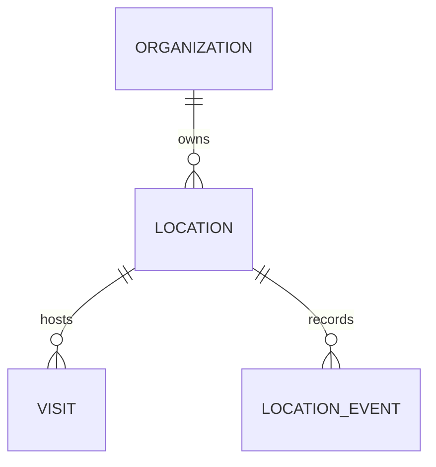

# Field Locations Domain Specification

## 1. Executive Summary

The FieldOps Location Engine provides reusable, geofenced geographic destinations for field visits, tasks, and asset inspections. Rather than storing ad-hoc unvalidated text addresses on individual visits, locations serve as authoritative customer sites, facilities, retail stores, or job campuses within the tenant organization.

---

## 2. Entity Schema & Attributes

### 2.1 Table: `locations`
- **ID (`id`)**: Primary UUIDv7 identifier.
- **Organization ID (`organization_id`)**: Partitioning key for PostgreSQL Row-Level Security (`tenant_id`).
- **Name (`name`)**: Human-readable name (2–255 characters, e.g. "Mission District Substation #4").
- **Address (`address`)**: Optional formatted street address / suite / city (up to 1,000 characters).
- **Latitude (`latitude`)**: Decimal coordinate constrained between $-90.0$ and $+90.0$ degrees.
- **Longitude (`longitude`)**: Decimal coordinate constrained between $-180.0$ and $+180.0$ degrees.
- **Allowed Radius (`allowed_radius_meters`)**: Circular geofence boundary in meters (integer between $10$ and $50,000$, default $100$m).
- **Status (`status`)**: Location lifecycle flag:
  - `ACTIVE`: Available for scheduling new visits and active operational checks.
  - `ARCHIVED`: Soft-deleted / retired location. Existing historical visits remain intact, but new visits cannot be scheduled against archived locations.
- **Metadata (`metadata`)**: JSONB key-value store for custom customer account numbers, gate access codes, and site hazards.
- **Timestamps**: `created_at`, `updated_at`.

---

## 3. Geofence Boundary Rules

1. **Minimum Geofence Radius**: 10 meters. Smaller radii trigger excessive GPS false negatives due to normal satellite atmospheric distortion and smartphone GPS drift.
2. **Maximum Geofence Radius**: 50,000 meters (50 km). Covers expansive rural sites, agricultural plots, or large campus parks.
3. **Coordinate Precision**: Latitudes and longitudes are stored with numeric floating precision preserving sub-meter ground resolution ($\approx 6$ decimal places).

---

## 4. RBAC & Access Control

- **View Locations (`LOCATION_VIEW_ALL`)**: Owners, Admins, Managers, and Supervisors.
- **View Assigned Locations (`LOCATION_VIEW_OWN`)**: Field Workers may view locations associated with their assigned tasks and visits.
- **Create & Edit Locations (`LOCATION_MANAGE`)**: Restricted to Owners, Admins, and Managers. Supervisors and Field Workers cannot create or alter location master data.
- **Archive Locations (`LOCATION_DELETE`)**: Restricted to Owners and Admins.

---

## 5. Audit Logging

Modifications to location coordinates, geofence radius expansions, or status changes are recorded in the organization audit log (`audit_logs`) to prevent unauthorized perimeter manipulation.
