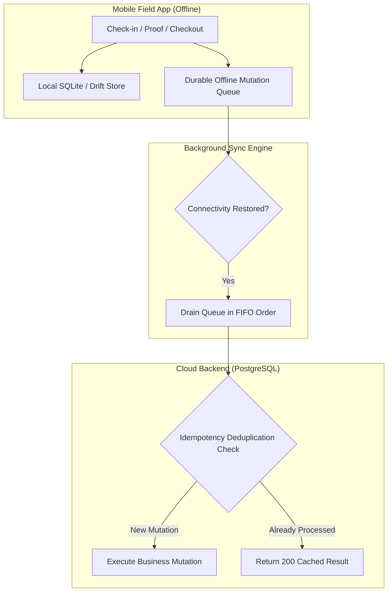

# Offline Field Operations & Synchronization Specification

## 1. Overview

Field technicians regularly operate in environments with poor or nonexistent cellular connectivity (basements, remote industrial facilities, rural agricultural plots, high-density metal buildings). FieldOps mobile architecture ensures that 100% of field visit workflows (arrival check-in, checklists, proof capture, notes, check-out) execute with zero latency while completely disconnected.

---

## 2. Offline Architecture & Mutation Queue

---

## 3. Offline Action Types

The `OfflineMutationQueue` persists four distinct visit mutation types:
1. **`visit.checkin`**:
   - Captures local coordinates, timestamp, accuracy, and exception notes.
   - Updates local visit status to `CHECKED_IN` immediately so the worker can proceed.
2. **`visit.checkout`**:
   - Captures departure coordinates, notes, and local elapsed duration.
   - Updates local visit status to `CHECKED_OUT`.
3. **`visit.proof`**:
   - Queues photo file references, signatures, or notes.
   - Binary media is cached locally in device filesystem storage until synced.
4. **`visit.status_change`**:
   - State machine transitions (`EN_ROUTE`, `IN_PROGRESS`, `COMPLETED`).

---

## 4. Idempotency & Deduplication Protocol

1. **Idempotency Key Format**:
   $$\text{idem\_}\{\text{userId}\}\_\{\text{entityId}\}\_\{\text{action}\}\_\{\text{clientTimestampMs}\}$$
2. **Server Deduplication**:
   When the mobile device reconnects and flushes the queue, the backend checks for prior execution of the key within `offline_mutations`. If the key exists, the request returns the prior response without duplicating check-in or proof rows.
3. **Optimistic Concurrency & Conflict Prevention**:
   Mutations include the visit `version`. If a dispatcher canceled or reassigned the visit while the technician was offline, the conflict is caught gracefully, notifying the user rather than corrupting server state.
