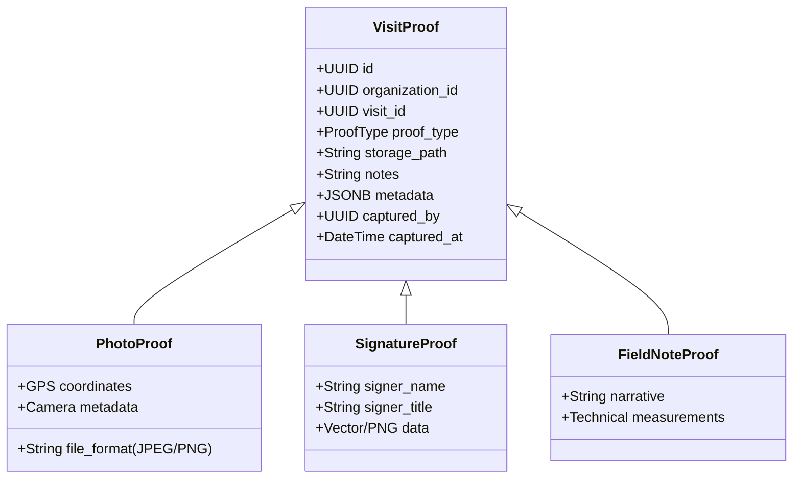

# Proof of Work Specification

## 1. Executive Summary

Proof of Work provides verifiable evidence that required physical tasks, inspections, repairs, or customer sign-offs occurred during a field visit. Completed proofs protect against customer disputes, demonstrate contractual compliance, and prevent fraudulent completion claims.

---

## 2. Proof Types & Evidence Formats

FieldOps supports three primary proof formats (`ProofType`):



1. **`PHOTO`**: High-resolution image of completed installation, asset tag, repaired component, or site condition. Includes geotag metadata and capture timestamp.
2. **`SIGNATURE`**: Client or site supervisor sign-off collected on the mobile touch screen, along with the signer's printed name and title.
3. **`NOTE`**: Detailed technical notes, asset serial numbers, or operational findings written by the field technician.

---

## 3. Storage & Integrity Architecture

- **Supabase Storage Isolation**: Media files are saved to an isolated storage bucket under the path:
  `tenants/{tenant_id}/visits/{visit_id}/proofs/{proof_id}.{ext}`
- **Row-Level Security on Storage**: Download URLs are signed with short expiry times (e.g., 60 minutes) to prevent unauthorized public scraping of sensitive customer site photographs.
- **Permanent Retention**: Once attached to a visit, proof records cannot be updated or deleted by field workers. Deletion requires organization owner authority.

---

## 4. Completion Gating Rules

A visit cannot transition from `CHECKED_OUT` to `COMPLETED` unless all required evidence is satisfied:
- **Configurable Proof Requirements**: Organizations can require minimum photo counts (e.g. "at least 2 photos required") or mandatory customer signatures via `OrganizationSettings` or visit templates.
- **Server Enforcement**: The transition stored procedure `transition_visit_status` counts existing `visit_proofs` rows for the visit and rejects completion if the count is insufficient:
  ```sql
  IF proof_count < required_proof_count THEN
    RAISE EXCEPTION 'Cannot complete visit: required proofs missing';
  END IF;
  ```
