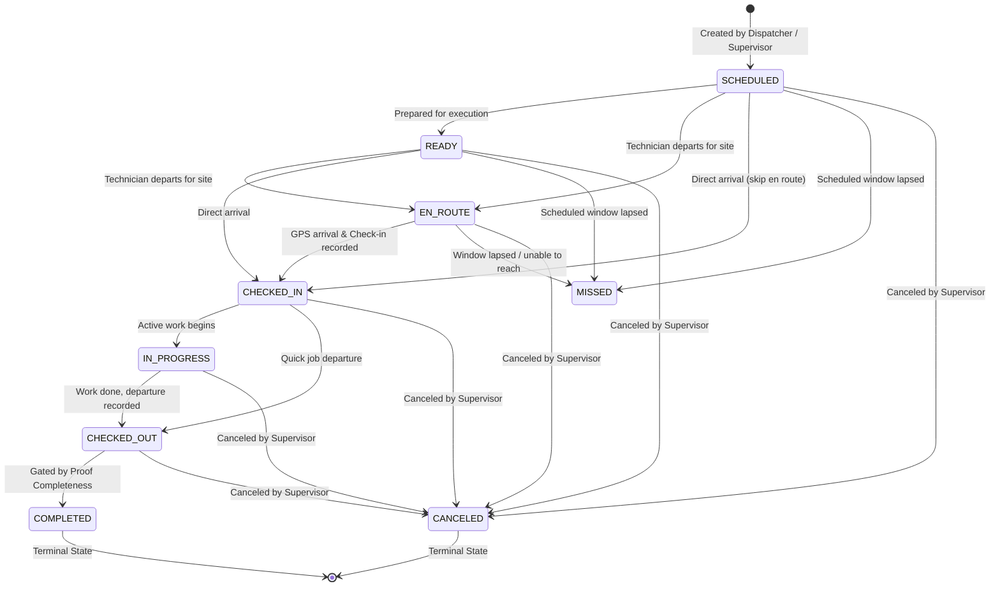

# Field Visit Lifecycle & State Machine Specification

## 1. Overview

Field visits adhere to a strictly validated finite state machine. Transitions must follow legitimate operational sequences. Skipping stages (such as jumping directly from `SCHEDULED` to `COMPLETED`) is strictly rejected by both client-side validation logic and database stored procedures (`transition_visit_status`).

---

## 2. State Machine Diagram

---

## 3. Transition Rules & Preconditions

| From State | To State | Permitted Roles | Preconditions & Requirements |
| :--- | :--- | :--- | :--- |
| `SCHEDULED` | `READY` | Owner, Admin, Mgr, Sup, Worker | Visit acknowledged by technician. |
| `SCHEDULED` / `READY` | `EN_ROUTE` | Field Worker, Sup, Mgr | Worker traveling towards location. |
| Any pre-arrival | `CHECKED_IN` | Field Worker, Sup | Valid GPS fix within geofence OR geofence override with exception reason. Creates `visit_checkins` record. |
| `CHECKED_IN` | `IN_PROGRESS` | Field Worker, Sup | Technician actively executing checklist or work. |
| `CHECKED_IN` / `IN_PROGRESS` | `CHECKED_OUT` | Field Worker, Sup | Departure GPS fix recorded. Creates `visit_checkouts` record. |
| `CHECKED_OUT` | `COMPLETED` | Field Worker, Sup, Mgr, Admin | **Mandatory Gates**: (1) Must have recorded check-out, and (2) Must satisfy all mandatory proof requirements (`proofCount >= requiredProofCount`). |
| Any active state | `CANCELED` | Owner, Admin, Mgr, Sup | **Forbidden to Field Workers**. Requires non-empty `cancellation_reason`. |
| Any active state | `MISSED` | System, Sup, Mgr, Admin | Scheduled end window passed without arrival check-in. |

---

## 4. Terminal State Invariants

- **`COMPLETED`**: A completed visit represents certified operational work. Its status cannot be mutated, check-in/out records cannot be modified, and attached proofs are permanently sealed.
- **`CANCELED`**: A canceled visit is closed immediately. No arrival check-in, departure checkout, or proof attachments can be registered against a canceled visit.

---

## 5. Append-Only Activity Log

Every status transition automatically creates a new row in `visit_activities`:
- `actor_id`: User initiating the transition.
- `action`: `STATUS_CHANGE`.
- `previous_status`: The former state.
- `new_status`: The new state.
- `metadata`: JSON payload containing context (e.g. override notes, cancellation reasons).
- Enforced immutable by trigger `prevent_visit_activity_modification()`.
