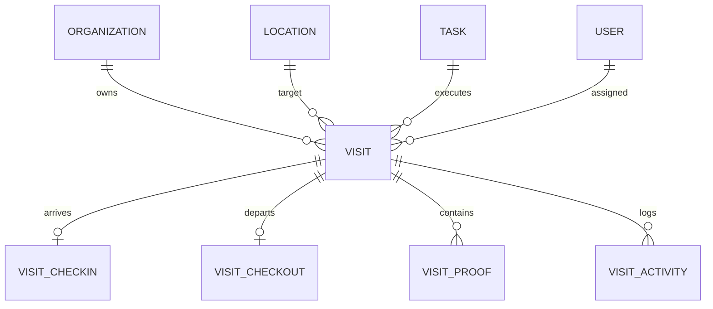

# Field Visits Domain Specification

## 1. Executive Summary

A Field Visit represents a scheduled or ad-hoc physical appointment where a field worker travels to an authoritative `location` to perform operational tasks, conduct site audits, or provide client services. Visits record real-world execution evidence, including arrival check-in, departure check-out, duration, and tamper-proof proof of work.

---

## 2. Core Entities & Relationships

### 2.1 Table: `visits`
- **ID (`id`)**: Primary UUIDv7 identifier.
- **Organization ID (`organization_id`)**: Partitioning key for strict multi-tenant isolation.
- **Location ID (`location_id`)**: Foreign key referencing the target `locations` record.
- **Task ID (`task_id`)**: Optional foreign key associating the visit with an overarching task or project.
- **Assigned To (`assigned_to`)**: User ID of the assigned field technician.
- **Status (`status`)**: Finite state machine status (`SCHEDULED`, `READY`, `EN_ROUTE`, `CHECKED_IN`, `IN_PROGRESS`, `CHECKED_OUT`, `COMPLETED`, `CANCELED`, `MISSED`).
- **Scheduled Window**:
  - `scheduled_start`: UTC timestamp when work is planned to begin.
  - `scheduled_end`: Optional UTC timestamp when work is planned to conclude. Must be at or after `scheduled_start`.
- **Actual Timestamps**:
  - `actual_start`: Set when arrival check-in occurs.
  - `actual_end`: Set when departure check-out occurs.
  - `completed_at`: Set when the visit is marked completed.
  - `canceled_at`: Set if the visit is canceled by a supervisor.
  - `cancellation_reason`: Required explanation when canceled.
- **Version (`version`)**: Integer incremented on each status transition and update, enforcing optimistic concurrency control.
- **Metadata (`metadata`)**: JSONB key-value store for customer contacts, access instructions, or external work order IDs.

---

## 3. Task-to-Visit Relationship

- **1-to-Many Architecture**: A single large Task (e.g., "Annual HVAC Overhaul at Campus Alpha") can spawn multiple Visits across several days or multiple specialized technicians.
- **Decoupled Lifecycle**: A visit can complete independently, feeding verification proof and checklist progress back into the parent task.

---

## 4. Scheduling & Overdue Rules

1. **Scheduling Constraints**: Visits can be scheduled for any future or current timestamp. `scheduled_end` must be greater than or equal to `scheduled_start`.
2. **Overdue / Missed Evaluation**:
   - Evaluated dynamically via `isVisitOverdue(visit)`.
   - If `now > (scheduled_end || scheduled_start)` and the visit is still in `SCHEDULED`, `READY`, or `EN_ROUTE`, it is flagged as overdue / missed in dispatcher consoles.
