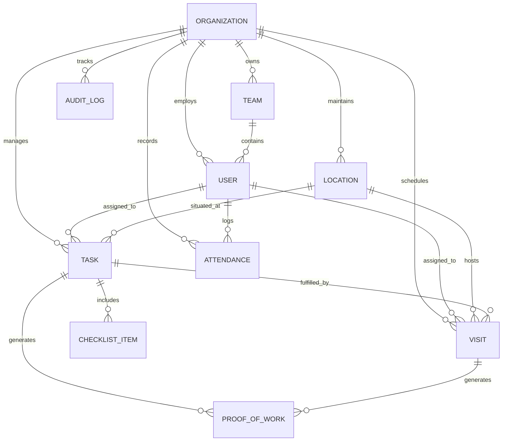
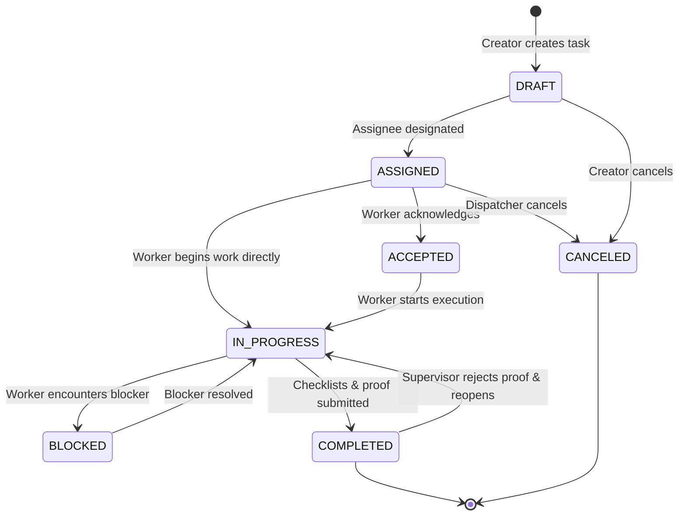
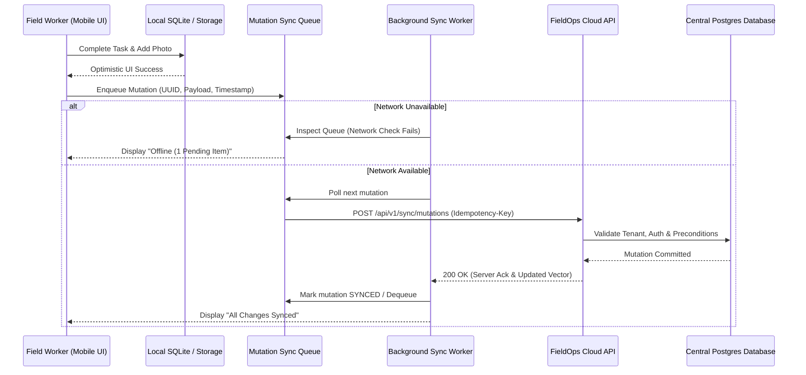

# FieldOps — Product Requirements Document (PRD)

**Document Version**: 1.0.0  
**Phase**: Phase 01 — Product, Brand & Foundation  
**Status**: Approved Source of Truth  
**Target Release**: V1.0  

---

## 1. Executive Summary & System Architecture

FieldOps is a multi-tenant B2B SaaS platform engineered for field force execution, task dispatch, and physical presence verification.

FieldOps delivers two synchronized client interfaces built on a unified multi-tenant backend:
1. **Web Management Console**: Responsive web portal for Owners, Admins, Managers, and Supervisors to orchestrate dispatch, monitor real-time field operations, review proofs, triage exceptions, and generate reports.
2. **Mobile Field Client (Android & iOS)**: First-class native/hybrid mobile application for Field Workers to track daily shifts, execute visits and tasks, capture tamper-evident proofs, and work reliably offline in dead zones.

---

## 2. Core Domain Data Model



### 2.1. Domain Entities & Core Attributes

#### 1. Organization (`tenants`)
- `id`: UUID (Primary Key)
- `name`: String (Company name)
- `slug`: String (Unique URL subdomain identifier)
- `subscription_tier`: Enum (`TRIAL`, `STARTER`, `BUSINESS`, `ENTERPRISE`)
- `subscription_status`: Enum (`ACTIVE`, `PAST_DUE`, `CANCELED`, `SUSPENDED`)
- `settings`: JSONB (Timezone, date format, default allowed geofence radius)
- `created_at`, `updated_at`: Timestamps with timezone

#### 2. User (`users` & `memberships`)
- `id`: UUID
- `organization_id`: UUID (Foreign Key)
- `email`: String (Unique within system)
- `full_name`: String
- `phone_number`: String (E.164 format)
- `role`: Enum (`OWNER`, `ADMIN`, `MANAGER`, `SUPERVISOR`, `FIELD_WORKER`)
- `status`: Enum (`INVITED`, `ACTIVE`, `DEACTIVATED`)
- `avatar_url`: String (Nullable)

#### 3. Team (`teams`)
- `id`: UUID
- `organization_id`: UUID
- `name`: String
- `description`: String (Nullable)
- `manager_id`: UUID (User FK, Nullable)
- `supervisor_id`: UUID (User FK, Nullable)

#### 4. Location (`locations`)
- `id`: UUID
- `organization_id`: UUID
- `name`: String (e.g., "North Metro Substation", "Client Site #402")
- `address_line1`: String
- `address_line2`: String (Nullable)
- `city`, `state_province`, `postal_code`, `country`: Strings
- `latitude`: Float (WGS 84, Decimal degrees)
- `longitude`: Float (WGS 84, Decimal degrees)
- `allowed_radius_meters`: Integer (Default: 100m)

#### 5. Task (`tasks`)
- `id`: UUID
- `organization_id`: UUID
- `title`: String (Short actionable title)
- `description`: Text (Markdown-supported instructions)
- `creator_id`: UUID (User FK)
- `assignee_id`: UUID (User FK, Nullable if assigned only to team)
- `team_id`: UUID (Team FK, Nullable)
- `location_id`: UUID (Location FK, Nullable for location-independent tasks)
- `priority`: Enum (`LOW`, `MEDIUM`, `HIGH`, `URGENT`)
- `status`: Enum (`DRAFT`, `ASSIGNED`, `ACCEPTED`, `IN_PROGRESS`, `BLOCKED`, `COMPLETED`, `CANCELED`)
- `due_datetime`: Timestamp with timezone
- `checklist`: Array of JSON objects `[{ id, title, is_required, is_completed, completed_at, completed_by }]`
- `blocked_reason`: Text (Populated when status is `BLOCKED`)
- `created_at`, `updated_at`: Timestamps with timezone

#### 6. Field Visit (`visits`)
- `id`: UUID
- `organization_id`: UUID
- `location_id`: UUID (Location FK, Mandatory)
- `assigned_user_id`: UUID (User FK, Mandatory)
- `task_id`: UUID (Task FK, Optional link to parent task)
- `scheduled_start`: Timestamp with timezone
- `scheduled_end`: Timestamp with timezone
- `status`: Enum (`SCHEDULED`, `EN_ROUTE`, `CHECKED_IN`, `COMPLETED`, `MISSED`, `CANCELED`)
- `check_in_time`: Timestamp (Nullable)
- `check_in_latitude`: Float (Nullable)
- `check_in_longitude`: Float (Nullable)
- `check_in_accuracy_meters`: Float (Nullable)
- `check_in_distance_meters`: Float (Calculated distance to location target)
- `check_in_result`: Enum (`VALID`, `LOCATION_EXCEPTION`, `OVERRIDDEN`)
- `check_out_time`: Timestamp (Nullable)
- `check_out_latitude`: Float (Nullable)
- `check_out_longitude`: Float (Nullable)
- `check_out_distance_meters`: Float (Nullable)
- `notes`: Text (Field technician visit notes)

#### 7. Attendance Record (`attendance_records`)
- `id`: UUID
- `organization_id`: UUID
- `user_id`: UUID (User FK)
- `clock_in_time`: Timestamp with timezone
- `clock_in_latitude`: Float
- `clock_in_longitude`: Float
- `clock_in_accuracy`: Float
- `clock_out_time`: Timestamp with timezone (Nullable while clocked in)
- `clock_out_latitude`: Float (Nullable)
- `clock_out_longitude`: Float (Nullable)
- `clock_out_accuracy`: Float (Nullable)
- `status`: Enum (`CLOCKED_IN`, `ON_BREAK`, `CLOCKED_OUT`)
- `is_manually_adjusted`: Boolean (Default: false)
- `adjustment_reason`: Text (Nullable, required if adjusted)

#### 8. Proof of Work (`proof_of_work`)
- `id`: UUID
- `organization_id`: UUID
- `task_id`: UUID (Nullable)
- `visit_id`: UUID (Nullable)
- `captured_by_user_id`: UUID (User FK)
- `type`: Enum (`PHOTO`, `SIGNATURE`, `CHECKLIST_SUMMARY`, `NOTES`)
- `media_url`: String (S3/Cloud storage path)
- `thumbnail_url`: String (Nullable)
- `metadata`: JSONB (EXIF timestamp, GPS coordinates of capture, device model, file hash)
- `signer_name`: String (Populated for `SIGNATURE` type)
- `signer_title`: String (Populated for `SIGNATURE` type)
- `captured_at`: Timestamp with timezone

#### 9. Audit Log (`audit_logs`)
- `id`: UUID
- `organization_id`: UUID
- `actor_id`: UUID (User FK)
- `action`: String (e.g., `TASK_CREATED`, `GEOFENCE_OVERRIDDEN`, `ATTENDANCE_ADJUSTED`)
- `entity_type`: String (`tasks`, `visits`, `attendance_records`, `memberships`)
- `entity_id`: UUID
- `previous_state`: JSONB (Nullable)
- `new_state`: JSONB (Nullable)
- `ip_address`: String (Nullable)
- `user_agent`: String (Nullable)
- `created_at`: Timestamp with timezone

---

## 3. Task Management Specification

### 3.1. Difference Between a Task and a Field Visit

| Dimension | Task | Field Visit |
| :--- | :--- | :--- |
| **Primary Concept** | An operational unit of work or work package with a deliverable. | A physical, time-bounded appointment at a verified geographic location. |
| **Location Requirement**| Optional. Can be remote, depot-based, or bound to a site. | Mandatory. Must have exact coordinates and a geofence radius. |
| **Time Model** | Due date / SLA deadline. | Scheduled arrival window (e.g. 09:00 - 11:00). |
| **Verification** | Checklist completion, photo evidence, review sign-off. | Geofenced GPS check-in/out, arrival timestamp, on-site duration. |
| **Relationship** | Can spawn or contain one or more Field Visits. | Can fulfill a Task or exist as a recurring scheduled inspection visit. |

### 3.2. Task Lifecycle State Machine



### 3.3. State Transition Matrix & Permissions

| From State | To State | Permitted Roles | Mandatory Preconditions | Side Effects |
| :--- | :--- | :--- | :--- | :--- |
| `[None]` | `DRAFT` | Owner, Admin, Manager, Supervisor | Title provided. | Audit log created. |
| `DRAFT` | `ASSIGNED` | Owner, Admin, Manager, Supervisor | Assignee or Team specified. | Push notification to worker. |
| `ASSIGNED` | `ACCEPTED` | Assignee (Field Worker) | User is assigned worker. | Timestamp recorded; dispatcher sees acknowledged. |
| `ASSIGNED` | `IN_PROGRESS`| Assignee | User is assigned worker. | Task auto-accepted; timer starts. |
| `ACCEPTED` | `IN_PROGRESS`| Assignee | User is assigned worker. | Started timestamp recorded. |
| `IN_PROGRESS`| `BLOCKED` | Assignee, Supervisor | Non-empty `blocked_reason`. | Alert triggered to Supervisor dashboard. |
| `BLOCKED` | `IN_PROGRESS`| Assignee, Supervisor | Blocker resolution notes added.| Blocker flag cleared. |
| `IN_PROGRESS`| `COMPLETED` | Assignee, Supervisor, Manager | All required checklist items checked; required proof attached. | Completion timestamp recorded; SLA locked. |
| `COMPLETED` | `IN_PROGRESS`| Supervisor, Manager, Admin | Re-open reason specified. | Task status reverted; notification sent to worker. |
| Any non-closed | `CANCELED`| Owner, Admin, Manager, Supervisor | Cancellation reason specified. | Notifications sent; open visits canceled. |

**Illegal Transitions**:
- Direct mutation from `DRAFT` to `COMPLETED` is forbidden.
- Transitioning to `COMPLETED` without fulfilling mandatory checklist items or mandatory photos is blocked by server-side validation.
- Arbitrary jumping between states without matching transition rules returns HTTP 422 Unprocessable Entity.

---

## 4. Field Visit Specification & GPS Geofencing

### 4.1. The Geofence Distance Calculation

Geodesic distance between the field worker's reported GPS coordinates $(lat_1, lon_1)$ and the target location $(lat_2, lon_2)$ is calculated using the standard Great-Circle Haversine formula:

$$a = \sin^2\left(\frac{\Delta lat}{2}\right) + \cos(lat_1) \cdot \cos(lat_2) \cdot \sin^2\left(\frac{\Delta lon}{2}\right)$$
$$c = 2 \cdot \text{atan2}\left(\sqrt{a}, \sqrt{1-a}\right)$$
$$d = R \cdot c$$
*(where $R = 6,371,000\text{ meters}$, the mean radius of Earth).*

### 4.2. Geofence Evaluation & Exception Handling

When a worker triggers **Check-In**:
1. Device samples high-accuracy GPS fix with horizontal accuracy $acc$ (in meters).
2. If $acc > 50\text{m}$, the mobile app warns the user and retries for up to 10 seconds to acquire a higher-accuracy satellite fix.
3. The server (or local engine if offline) evaluates calculated distance $d$:
   - If $d \le \text{allowed\_radius\_meters}$: Check-in status is marked **`VALID`**.
   - If $d > \text{allowed\_radius\_meters}$: Check-in status is marked **`LOCATION_EXCEPTION`**.
4. In the event of a `LOCATION_EXCEPTION`:
   - The worker is **not** blocked from performing their job (to avoid stalling emergency repairs when site coordinates are slightly off or parking is far away).
   - The app explicitly displays an alert: *"You are 240m away from the registered site location. This check-in will be flagged for supervisor review."*
   - Worker must enter an optional note explaining the discrepancy (e.g., "Security gate entrance at rear").
   - The exception is immediately highlighted in orange/red on the Manager Dashboard.

### 4.3. GPS & Privacy Governance

FieldOps adheres to transparent, ethical workforce location practices:
1. **No 24/7 Spyware / Unrestricted Tracking**: FieldOps **never** tracks workers when they are off duty or clocked out.
2. **Point-in-Time Event Capture**: Location is deterministically captured upon:
   - Shift Clock-In / Clock-Out
   - Visit Check-In / Check-Out
   - Task State Transitions (`IN_PROGRESS`, `BLOCKED`, `COMPLETED`)
   - Proof of Work capture (Photo EXIF tag verification)
3. **Active Duty Breadcrumb (Configurable)**: While clocked in and `EN_ROUTE` to a visit, low-power periodic heartbeat location pings (every 5–15 minutes) may be enabled if configured by the tenant organization.
4. **Transparency**: The mobile UI features a prominent, persistent status badge whenever location services are active.
5. **Data Retention**: Granular GPS coordinate trails are automatically purged or downsampled after 90 days, retaining only the immutable visit check-in audit records.

---

## 5. Proof of Work (PoW) Engine

Proof of work provides undeniable evidence of physical service execution.

### 5.1. Proof Types & Validation Rules

1. **Photographic Evidence**:
   - Captured strictly through the in-app camera interface (gallery photo uploads can be restricted by tenant policy to prevent reusing old photos).
   - Cryptographic SHA-256 hash computed locally upon capture.
   - Watermarked with: Organization Name, Worker Name, UTC Timestamp, and GPS Coordinates.
   - Preserved in original quality and compressed web view.
2. **Customer / Site Signatures**:
   - Vector signature captured on device touchscreen.
   - Associated with signatory's typed name, title/relationship, and capture timestamp.
3. **Structured Checklists**:
   - Step-by-step verification items (e.g., "Shut off main valve", "Inspect pressure gauge").
   - Items can be flagged as `mandatory` (blocks task completion until checked).
   - Each item captures completion timestamp and worker ID.
4. **Contextual Notes**:
   - Freeform text observations, equipment model/serial numbers, or customer remarks.

---

## 6. Mobile Application Specification (Android & iOS)

### 6.1. Navigation Architecture

Bottom Navigation Bar:
1. **Home**: Shift status widget (Clock In/Out button, current shift timer), Today's operational summary, Next up appointment card, Quick sync status indicator.
2. **Tasks**: Filterable list (Assigned, In Progress, Completed), Priority tags, Due dates, Search.
3. **Visits**: Chronological timeline of today's scheduled stops, address, direct "Navigate" button (launches Google/Apple Maps).
4. **Activity**: Local sync queue, history of today's logged events, offline queue inspector.
5. **Profile**: Worker identity, assigned team, app version, offline storage cache manager, logout.

### 6.2. Mobile Flow Specifications

#### Flow A: Authentication & Onboarding
```
Launch App 
  → Enter Email/Password (or Magic Link)
  → Tenant Context Validation (select org if multi-org)
  → Runtime Permissions Request (Camera, Precise Location, Notifications)
  → Initial Delta Sync Download
  → Land on Home Screen
```

#### Flow B: Shift Attendance
```
Home Screen 
  → Tap "Clock In" 
  → Acquire GPS Fix (< 50m accuracy)
  → Confirm Presence
  → State changes to CLOCKED_IN 
  → Shift timer initiates 
  → Local record created & queued for sync
```

#### Flow C: Field Visit & Task Execution
```
Visits Tab 
  → Select Visit 
  → View Site Details & Checklist Preview
  → Tap "Navigate" (Deep links to external Maps)
  → Arrive on Site 
  → Tap "Check In"
  → System computes distance against site geofence:
      ├── If Valid: Instant Check-In Confirmed
      └── If Exception: Display Distance Warning → Prompt Reason → Record Exception
  → Open Associated Task 
  → Tap "Start Task" (Status → IN_PROGRESS)
  → Complete Checklists
  → Tap "Add Proof" → Take Photo → Capture Signature
  → Tap "Complete Task" (Validation checks: all mandatory items fulfilled)
  → Return to Visit → Tap "Check Out"
  → Mark Visit COMPLETED
```

---

## 7. Offline-First Architecture & Synchronization Engine

Field workers routinely operate in basements, rural towers, and reinforced concrete facilities with zero cellular connectivity. **Offline operation is a first-class requirement, not a degraded fallback.**

### 7.1. Offline Principles
- Every read must succeed instantly from the local database.
- Every write must succeed locally and immediately update the UI (optimistic UI update).
- Network restoration triggers automatic, background delta synchronization.
- Data loss is unacceptable: a local mutation must survive app backgrounding, termination, device restart, and battery death.

### 7.2. Synchronization Protocol



### 7.3. Conflict Resolution Rules

1. **Task Assignments & Cancellations**: **Server Authoritative**. If a dispatcher cancels a task while a worker is offline, upon reconnecting the server's cancellation takes precedence. Any proof of work captured before the cancellation timestamp is preserved in the audit log as orphaned evidence.
2. **Proof of Work & Checklists**: **Client Append-Only**. Proof of work items generated offline have client-generated UUIDs. The server will never overwrite or discard submitted photos, notes, or checklist entries.
3. **Status Race Conditions**: Resolved via monotonic timestamps and state machine rules. A `COMPLETED` state transition submitted with valid offline proof will not be overwritten by a stale web dashboard edit.

---

## 8. Web Management Console Specification

### 8.1. Information Architecture & Navigation

The Web Console navigation is organized into six functional areas:
1. **Dashboard**: Operational pulse, real-time metrics, exception feed, today's queue.
2. **Operations**:
   - **Tasks**: List and Kanban view of all tasks across organization.
   - **Visits**: Dispatch schedule, arrival verification status, SLA tracking.
   - **Calendar**: Dispatcher schedule board (Day/Week/Month) with worker lane allocation.
   - **Live Map**: Real-time interactive map showing registered client locations and last-known technician check-in points.
3. **Workforce**:
   - **Employees**: Roster, roles, contact details, account status.
   - **Teams**: Territory groupings, assigned managers, supervisor links.
   - **Attendance**: Live clock-in status, daily shift logs, manual correction interface (audited).
   - **Locations**: Customer site directory, geofence radius settings, coordinate picker.
4. **Reports**:
   - **Task SLA & Turnaround**: Time to completion, bottleneck analysis.
   - **Attendance & Punctuality**: Shift compliance, missed clock-outs.
   - **Visit Verification**: Pass/exception rates, site dwell time.
   - **Export Center**: CSV and PDF batch exports.
5. **Organization**:
   - **Members & Invitations**: Manage staff access.
   - **Roles & Permissions**: RBAC capability matrix viewer.
   - **Settings**: Timezone, regional settings, default geofence parameters.
6. **Administration**:
   - **Audit Logs**: Immutable log of all administrative and security actions.
   - **Notifications**: Broadcast alerts, exception thresholds.
   - **Security**: Password policies, active session termination.
7. **Billing (Anticipated)**:
   - Subscription plan overview, active worker seat usage, storage utilization.

---

## 9. Performance Budgets & Non-Functional Requirements

To ensure field reliability and snappy web interactions, FieldOps enforces strict non-functional constraints:

| Metric | Target Budget | Test Conditions |
| :--- | :--- | :--- |
| **Mobile Cold Start to Home Screen** | $\le 1.8\text{ seconds}$ | Mid-range Android device (e.g. Pixel 4a / Samsung A52), cold process |
| **Local Task Mutation Latency** | $\le 80\text{ ms}$ | From tap to optimistic UI confirmation on mobile |
| **GPS Fix Acquisition Timeout** | $\le 10\text{ seconds}$ | High-accuracy hardware location provider |
| **Web Dashboard First Usable Paint** | $\le 1.2\text{ seconds}$ | Desktop broadband, standard cache |
| **Delta Sync Payload Size** | $\le 150\text{ KB}$ | Normal 100-task delta update |
| **Mobile Battery Consumption** | $\le 3.5\%\text{ per 8-hr shift}$| Standard duty cycle (15 visits, no continuous GPS streaming) |
| **Offline Storage Footprint** | $\le 50\text{ MB}$ | Excluding cached media attachments |
| **API Response Time (p95)** | $\le 200\text{ ms}$ | Standard authenticated CRUD operations |
| **Tenant Isolation Enforcement** | $100\%$ zero leakage | Validated via automated cross-tenant security test suites |
