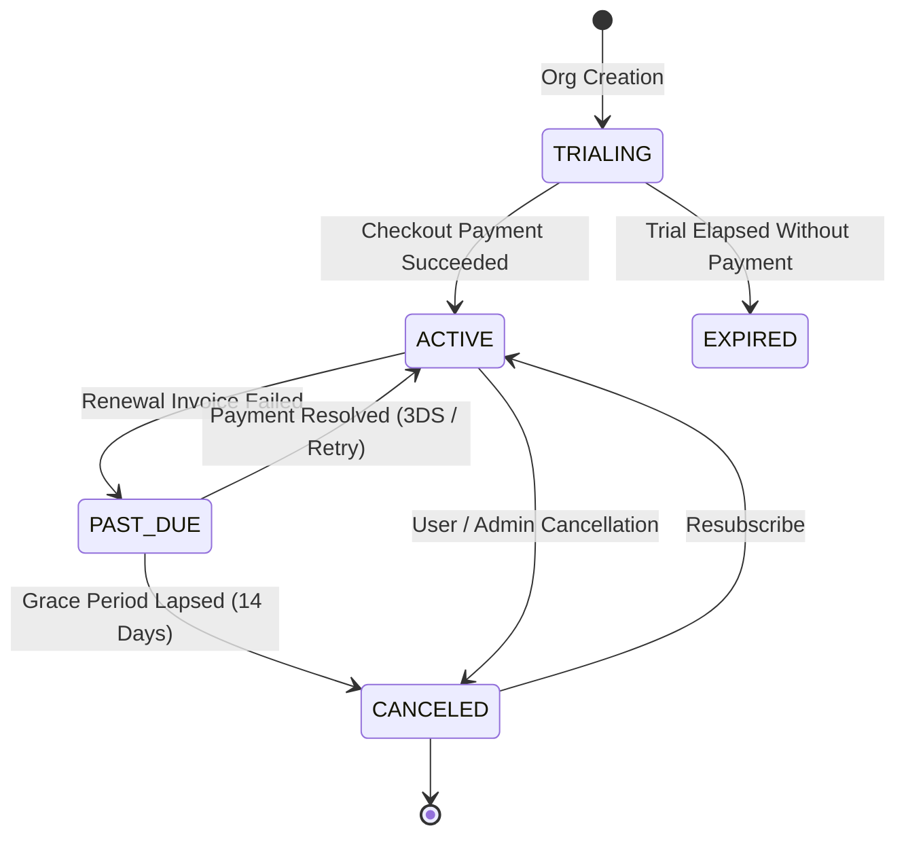

# SaaS Subscription & Billing Product Specifications

## 1. Commercial Model & Subscription Tiers

FieldOps operates on a tiered recurring B2B SaaS subscription model designed for SMB field organizations. Each organization belongs to exactly one active subscription plan.

### Tier Summary
| Plan | Intended Audience | Price (Monthly / Annual) | Active Workers Limit | Locations Limit | Monthly Visits Limit | Monthly Exports Limit | Reporting |
| :--- | :--- | :--- | :--- | :--- | :--- | :--- | :--- |
| **FREE** | Trial & Evaluators | $0 / mo | Up to 3 | Up to 5 | 50 | 5 | Basic View |
| **STARTER** | Small Service Crews | $29 / mo ($290/yr) | Up to 10 | Up to 25 | 300 | 50 | Full View & CSV Export |
| **GROWTH** | Growing Field Operations | $79 / mo ($790/yr) | Up to 30 | Up to 100 | 1,500 | 200 | Advanced Reporting |
| **BUSINESS** | Multi-Branch Enterprises | $199 / mo ($1990/yr) | Up to 100 | Up to 500 | 10,000 | 1,000 | Advanced + Audit Exports |

---

## 2. Subscription States & Transitions

### State Behavior
1. **TRIALING**: 14-day full platform evaluation.
2. **ACTIVE**: Standard operational state; all plan entitlements active.
3. **PAST_DUE**: Renewal payment failed. Organization enters a **14-day Grace Period**. Field dispatch remains active; web console displays a persistent payment warning banner with a link to the billing portal.
4. **CANCELED**: Subscription canceled by user. If canceled at period end, access continues until `currentPeriodEnd`. Afterwards, limits revert to the FREE tier without deleting historical data.
5. **EXPIRED**: Trial or grace period lapsed without resolution. Creation of new tasks and visits is paused.
