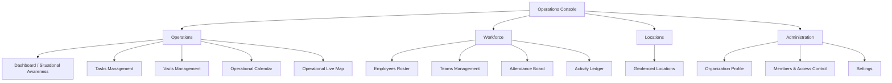

# Web Operations Console & Dashboard Specifications

## 1. Overview & Purpose

The **FieldOps Web Operations Console** serves as the central mission-control surface for authorized business owners, administrators, operations managers, and field supervisors. It provides situational awareness of field activities, task assignments, visits, workforce attendance, and real-time operational exceptions.

---

## 2. Information Architecture & Navigation

The console is organized by core operational workflows:

### Route Structure
| Route | Page Name | Primary Objective |
| :--- | :--- | :--- |
| `/dashboard` | Operations Dashboard | Live situational awareness, operational KPIs, active work, and exception alerts. |
| `/tasks` | Task Operations | Server-filtered task lists, status lifecycle transitions, and assignment controls. |
| `/tasks/[id]` | Task Detail | Checklists, attachment previews, comments, history, and status progression. |
| `/visits` | Visit Operations | Scheduled field visits, assignment, status badges, and rescheduling. |
| `/visits/[id]` | Visit Detail | Geofence verification, proof of work galleries, and check-in/out telemetry. |
| `/calendar` | Operational Calendar | Day and Week dispatch views of scheduled visits and task due dates. |
| `/map` | Operational Map | Visual map of geofenced locations, discrete check-in pins, and geofence exceptions. |
| `/employees` | Workforce Roster | Active worker directory, shift status, and workload metrics. |
| `/teams` | Team Management | Operational crews, assigned members, and crew leadership. |
| `/attendance` | Attendance Monitoring | Server-authoritative shift ledger, duration calculations, and audited manual adjustments. |
| `/activity` | Worker Activity Ledger | Immutable chronological ledger of all field actions across the tenant. |
| `/locations` | Location Management | Customer sites, depot depots, geofence radius settings, and status. |
| `/organization/members` | Members & Access | Role assignments, member invitations, and final-owner protection. |

---

## 3. Operational Roles & Permitted Workflows

- **Owner & Admin**: Full operational access across all routes, membership invitation, team creation, attendance adjustments, and settings.
- **Operations Manager**: Full day-to-day dispatch authority, task/visit creation and assignment, workforce roster view, attendance monitoring and adjustments, exception resolution.
- **Field Supervisor**: Team-scoped task and visit management, attendance observation for assigned crews, exception review, geofence override verification.
- **Field Worker**: Limited web access focused on personal task and visit assignments, shift logs, and profile self-service.

---

## 4. Operational Exceptions Protocol

The Operations Console surfaces operational exceptions as high-priority alert cards on the Dashboard, Map, and Task/Visit listings:

1. **Blocked Tasks**: Tasks flagged with blockers require supervisor attention. Displays worker name, blocker reason, and one-click contact.
2. **Overdue Tasks**: Color-coded red badges with elapsed overdue duration.
3. **Missed Visits**: Visits unstarted past scheduled start + grace window.
4. **Geofence Violations**: Check-ins logged beyond site perimeter with mandatory worker explanation.
5. **Low GPS Accuracy**: Check-ins with $> 50$ meter accuracy requiring review.
