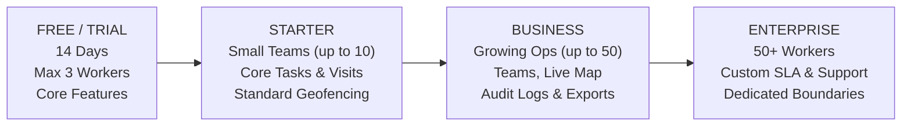

# FieldOps — V1 Scope & SaaS Model Foundation

---

## 1. Scope Overview

FieldOps V1 delivers a production-ready, multi-tenant field workforce and task management platform. This document defines the boundaries of what is included in the V1 release across all core modules and client applications.

---

## 2. Platform Delivery Matrix

| Platform | Primary Target Users | Form Factor | Core Responsibility |
| :--- | :--- | :--- | :--- |
| **Web Application** | Owners, Admins, Managers, Supervisors | Desktop & Laptop (1280px+), Tablet responsive | Dispatch, scheduling, real-time map oversight, exceptions, reports, settings, administration |
| **Android Application** | Field Workers | Smartphone (portrait-first), Android 10+ | Attendance check-in, visit execution, task checklists, photo/signature proof, offline sync |
| **iOS Application** | Field Workers | Smartphone (portrait-first), iOS 16+ | Attendance check-in, visit execution, task checklists, photo/signature proof, offline sync |

---

## 3. Detailed V1 Module Specification

### 3.1. Operations Module

The operational heart of FieldOps, facilitating planning, dispatch, and live field tracking.

- **Dashboard**:
  - Operational KPIs: Tasks Today, Completed vs. Pending vs. Overdue, Active Workers Clocked-In, Scheduled Visits, Location Exceptions.
  - Exception Feed: Flagged check-ins outside geofence, blocked tasks, unassigned urgent tasks.
  - Team Activity Feed: Real-time chronological audit of field events.
- **Tasks**:
  - Full CRUD operations with priority levels (`LOW`, `MEDIUM`, `HIGH`, `URGENT`).
  - Assignee and team binding, due dates, checklists, attachment viewing.
  - State machine transition engine (`DRAFT` → `ASSIGNED` → `ACCEPTED` → `IN_PROGRESS` → `BLOCKED` → `COMPLETED`).
- **Visits**:
  - Scheduled on-site appointments with physical coordinates and address.
  - Linking visits to one or more tasks.
  - Check-in / check-out timestamps with geofence distance calculation.
- **Calendar**:
  - Multi-view operational calendar (Day, Week, Month) partitioned by team and individual worker.
  - Drag-and-drop rescheduling (for web dispatchers).
- **Live Operational Map**:
  - Mapbox/Leaflet-based operational map displaying customer locations, planned visits, and workers' last verified check-in coordinates.
  - Color-coded pins for visit statuses (Scheduled, In Progress, Completed, Exception).

### 3.2. Workforce Module

Managing personnel, team structures, and daily shift status.

- **Employees**:
  - Workforce roster with profiles, contact info, assigned teams, and system roles.
  - Active/Inactive status toggle.
- **Teams**:
  - Hierarchical grouping of employees into operational territories or functional units.
  - Assignment of designated Managers and Supervisors to specific teams.
- **Attendance**:
  - Shift clock-in and clock-out with timestamp and GPS coordinates.
  - Real-time working status display (`CLOCKED_IN`, `ON_BREAK`, `CLOCKED_OUT`).
  - Attendance log viewer for managers with exception indicators.
- **Location Activity**:
  - Discrete location event log associated with attendance and visit transitions.
  - Distance verification against target destination geofences.

### 3.3. Reports Module

Operational reporting and auditing for management decision-making.

- **Task Reports**:
  - Completion rates, average turnaround time, overdue rate by priority and assignee.
- **Attendance Reports**:
  - Punctuality, hours on duty, missed check-outs, geofence exception logs.
- **Visit Reports**:
  - Time spent on site, planned vs. actual arrival times, verification pass rates.
- **Team Performance**:
  - Aggregate comparison of task velocity and completion consistency across teams.
  - CSV/PDF export capability for external review.

### 3.4. Organization Module

Tenant account administration and structural configuration.

- **Members**:
  - Invitation management, member deactivation, and profile oversight.
- **Teams & Territories**:
  - Organization-wide team management and territory boundary definitions.
- **Locations**:
  - Physical customer sites, branches, and service destinations with coordinates and allowed geofence radii.
- **Roles & Permissions**:
  - Fixed system roles (`Owner`, `Admin`, `Manager`, `Supervisor`, `Field Worker`) enforced via server-side RBAC.
- **Settings**:
  - Tenant preferences: Timezone, date format, default geofence radius (e.g., 100m), photo upload constraints.

### 3.5. Administration Module

Platform governance, compliance, and security monitoring.

- **Audit Logs**:
  - Immutable, append-only security log recording sensitive operations (role changes, manual attendance overrides, deletions, data exports).
- **Notifications**:
  - System event alerts (e.g., Task Assigned, Visit Overdue, Location Exception, Battery Critical).
- **Security Settings**:
  - Session timeout policies, password complexity rules, multi-factor authentication (MFA) enforcement toggles.

### 3.6. Billing Module (V1 Foundation)

Architectural and data model readiness for commercial SaaS operation.

- **Subscription Status**:
  - Tenant entitlement engine storing subscription tier, renewal date, and active/suspended flags.
- **Plan Definitions**:
  - Free/Trial, Starter, Business, Enterprise feature flags.
- **Usage Tracking**:
  - Real-time metering of active field worker seats and storage consumption.
- *Note: External payment gateway (e.g., Stripe) integration is planned for later phases; V1 enforces entitlement flags and seat counts.*

---

## 4. SaaS Business Model Foundation

FieldOps is architected around a tiered subscription model indexed primarily on **Active Field Worker Seats** and operational capacity.

### 4.1. Tier Architecture

### 4.2. Usage Dimensions

The data model and entitlement engine must support metering along seven dimensions:
1. **Active Field Workers**: Number of active worker accounts eligible to clock in and receive dispatch.
2. **Tasks Volume**: Monthly task dispatch limits (soft/hard caps depending on tier).
3. **Visits Volume**: Monthly visit scheduling capacity.
4. **Storage Quota**: GB of proof-of-work media (photos, signatures, attachments) stored in S3-compatible object storage.
5. **Saved Locations**: Number of pre-registered customer sites with geofences.
6. **Automation & Webhooks**: Monthly webhook invocations (for future integrations).
7. **Audit Retention**: Rolling retention window (e.g., 30 days on Starter, 1 year on Business, 7 years on Enterprise).
