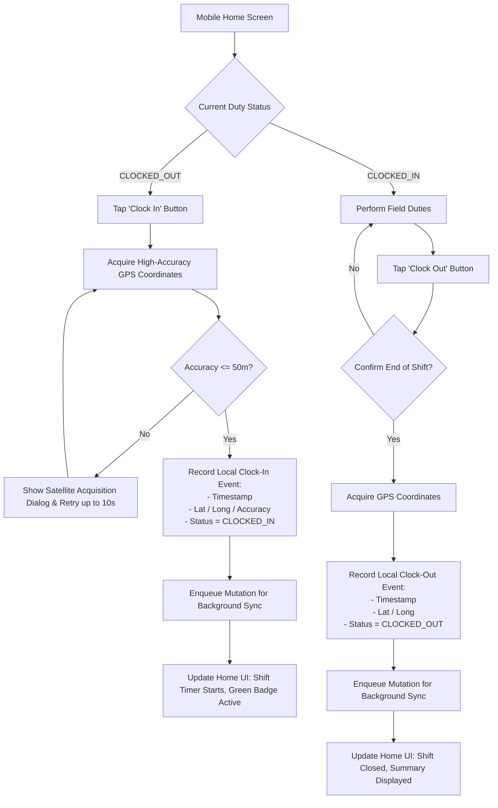
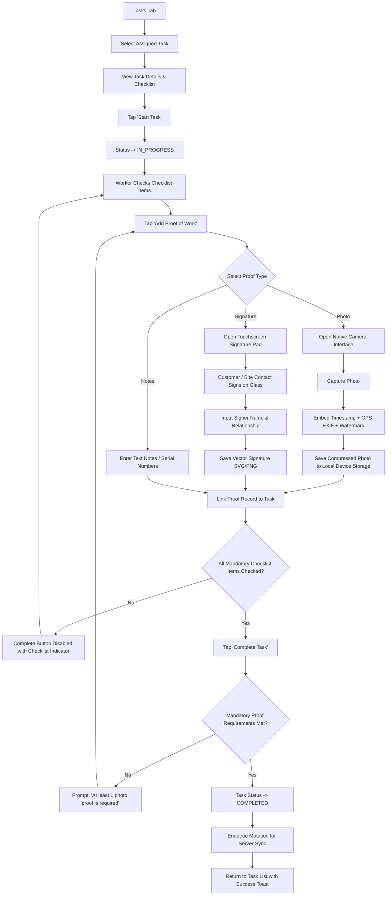
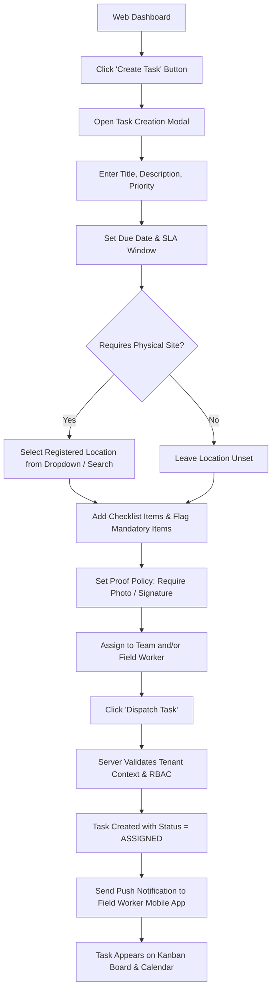

# FieldOps — User Flows Specification

---

## 1. Flow Overview

This document maps the primary end-to-end user flows for both the **FieldOps Mobile Application** (Field Workers) and the **FieldOps Web Console** (Dispatchers, Supervisors, Managers).

---

## 2. Mobile User Flows (Field Worker)

### Flow M-01: Authentication, Permissions & Onboarding

```mermaid
flowchart TD
    Launch[App Launch] --> CheckAuth{Has Valid Session Token?}
    CheckAuth -- Yes --> ValidateTenant{Validate Tenant Context}
    CheckAuth -- No --> LoginForm[Enter Email & Password]
    LoginForm --> SubmitLogin[POST /api/v1/auth/login]
    SubmitLogin --> CheckOrgCount{Belongs to Multiple Orgs?}
    CheckOrgCount -- Yes --> SelectOrg[Select Organization Screen]
    CheckOrgCount -- No --> SetActiveTenant[Set Active Tenant Context]
    SelectOrg --> SetActiveTenant
    ValidateTenant --> SetActiveTenant
    SetActiveTenant --> CheckPerms{Permissions Granted?}
    CheckPerms -- No --> PermScreen[Permissions Education Screen:\n- Precise Location (Check-ins)\n- Camera (Photo Proof)\n- Notifications (Dispatch)]
    PermScreen --> RequestOSPerms[Trigger OS Permission Dialogs]
    RequestOSPerms --> CheckPerms
    CheckPerms -- Yes --> DeltaSync[Execute Initial Delta Sync]
    DeltaSync --> LandHome[Land on Mobile Home Screen]
```

---

### Flow M-02: Shift Attendance Clock-In & Clock-Out



---

### Flow M-03: Field Visit Execution with Geofence Verification

```mermaid
flowchart TD
    VisitsTab[Visits Tab] --> SelectVisit[Select Scheduled Visit from Timeline]
    SelectVisit --> ViewVisitDetail[View Visit Detail:\n- Address\n- Time Window\n- Customer Info\n- Associated Tasks]
    ViewVisitDetail --> TapNavigate[Tap 'Navigate' Button]
    TapNavigate --> LaunchMaps[Deep Link to Google Maps / Apple Maps / Waze]
    LaunchMaps --> ArriveSite[Worker Arrives at Physical Destination]
    ArriveSite --> TapCheckIn[Tap 'Check In' Button]
    TapCheckIn --> SampleGPS[Capture Current GPS Coordinates]
    SampleGPS --> CalculateDistance[Calculate Haversine Distance to Site Center]
    CalculateDistance --> CheckRadius{Distance <= Allowed Radius?}

    CheckRadius -- Yes --> MarkValid[Check-In Status = VALID]
    CheckRadius -- No --> FlagException[Check-In Status = LOCATION_EXCEPTION]
    FlagException --> ShowWarningModal[Display Warning Modal:\n'You are X meters from registered site']
    ShowWarningModal --> EnterReason[Prompt Optional Location Note]
    EnterReason --> MarkValid

    MarkValid --> RecordCheckIn[Save Local Check-In Record]
    RecordCheckIn --> OpenTaskWork[Open Associated Task Checklist]
    OpenTaskWork --> ExecuteTasks[Execute Work & Capture Proof]
    ExecuteTasks --> TapCheckOut[Tap 'Check Out' Button]
    TapCheckOut --> CaptureExitGPS[Capture Exit GPS Coordinates]
    CaptureExitGPS --> MarkVisitComplete[Visit Status = COMPLETED]
    MarkVisitComplete --> EnqueueSyncVisit[Enqueue Background Sync]
```



---

### Flow M-04: Task Execution & Proof of Work Capture



---

### Flow M-05: Offline Synchronization & Conflict Handling

```mermaid
flowchart TD
    WorkerAction[Worker Completes Task / Check-In] --> WriteLocal[Write to Local SQLite Database]
    WriteLocal --> EnqueueItem[Insert Mutation Payload into Pending Sync Queue]
    EnqueueItem --> UpdateUIIcons[Status Bar Shows: 'Offline (N Pending Changes)']
    
    CheckNet{Network Connectivity Restored?}
    CheckNet -- No --> WaitRetry[Listen to OS Network State Change]
    WaitRetry --> CheckNet
    
    CheckNet -- Yes --> UpdateUIStatus[Status Bar Shows: 'Syncing...']
    UpdateUIStatus --> DequeueNext[Fetch Oldest Pending Mutation]
    DequeueNext --> SendToServer[POST /api/v1/sync/mutations with Idempotency Key]
    
    SendToServer --> ServerEval{Server Response}
    ServerEval -- 200 OK --> CommitServer[Server Commits Mutation & Returns Ack]
    CommitServer --> RemoveQueue[Remove Item from Local Queue]
    RemoveQueue --> HasMore{More Pending Items?}
    HasMore -- Yes --> DequeueNext
    HasMore -- No --> SetAllSynced[Status Bar Shows: 'All Changes Synced' (Green)]

    ServerEval -- 409 Conflict --> ConflictStrategy{Conflict Type}
    ConflictStrategy -- Task Canceled by Admin --> KeepProof[Keep Proof of Work; Flag Task as Canceled Locally]
    ConflictStrategy -- Stale Version --> MergeFields[Merge Non-Conflicting Fields; Last Write Wins on Proof]
    KeepProof --> RemoveQueue
    MergeFields --> RemoveQueue

    ServerEval -- 5xx / Network Drop --> ExponentialBackoff[Schedule Retry with Exponential Backoff + Jitter]
    ExponentialBackoff --> UpdateUIStatusFailed[Status Bar Shows: 'Sync Paused - Will Retry']
```

---

## 3. Web User Flows (Dispatch & Management)

### Flow W-01: Task Creation, Checklist Configuration & Dispatch



---

### Flow W-02: Real-Time Live Map Oversight & Exception Triage

```mermaid
flowchart TD
    OpenMap[Open Live Operational Map] --> LoadLayer[Render Map with Registered Customer Sites]
    LoadLayer --> RenderWorkers[Plot Worker Last Verified Positions]
    RenderWorkers --> HighlightExceptions{Any Check-Ins with LOCATION_EXCEPTION?}
    HighlightExceptions -- Yes --> FlashPin[Pin Flashes Amber / Red with Exception Tag]
    FlashPin --> ClickPin[Dispatcher Clicks Exception Pin]
    ClickPin --> ShowExceptionCard[Display Exception Flyout:\n- Worker Name\n- Target Site\n- Actual Distance (e.g. 350m)\n- Worker Reason Note\n- Check-In Timestamp]
    ShowExceptionCard --> DispatcherAction{Dispatcher Action}
    DispatcherAction -- Override & Approve --> ClickOverride[Click 'Approve Exception']
    ClickOverride --> LogOverrideAudit[Server Logs Audit Event with Dispatcher ID]
    LogOverrideAudit --> ClearAlert[Alert Cleared; Visit Status -> VALID]
    DispatcherAction -- Contact Worker --> CallWorker[Click Direct Phone Call Link]
    DispatcherAction -- Reassign --> ReassignTask[Open Reassign Flyout]
```
