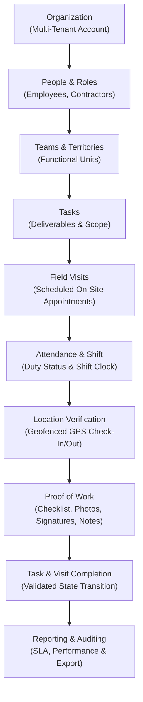

# FieldOps — Product Vision & Strategic Positioning

---

## 1. Executive Summary

**FieldOps** is a dedicated, multi-tenant SaaS platform built to empower small and medium-sized businesses (SMBs) to coordinate, execute, and verify physical field operations.

Modern SMBs operating field forces face a chronic disconnect between back-office management and frontline reality. Managers dispatch tasks over fragmented WhatsApp groups, SMS threads, paper job cards, and spreadsheets. When disputes arise over whether a worker arrived, what repairs were performed, or whether safety checklists were followed, managers lack verified data, and workers lack verifiable proof.

FieldOps solves this by establishing a single, verifiable system of record for real-world work.

---

## 2. The Core Product Promise

The product is built around a single positioning truth:

> **«Assign the work. Send the right person. Verify the work. Know what happened.»**

This promise drives every design, UX, and architectural decision:
- **Assign the work**: Managers create unambiguous tasks with concrete requirements, checklists, and priorities.
- **Send the right person**: Teams, skillsets, and schedules ensure tasks and visits are assigned to qualified personnel.
- **Verify the work**: Physical presence is confirmed via geofenced GPS check-ins, accompanied by tamper-resistant photographic and sign-off evidence.
- **Know what happened**: Real-time dashboards, audit logs, and operational reports provide leadership with undeniable visibility.

---

## 3. The Fundamental Operational Workflow

All operational data flows through a disciplined, directional lifecycle:

---

## 4. Sharp Strategic Boundaries: What FieldOps Is vs. What It Is Not

To maintain product velocity, intuitive UX, and operational excellence, FieldOps adheres to strict domain boundaries.

| Domain | What FieldOps Is | What FieldOps Is NOT |
| :--- | :--- | :--- |
| **Operational Execution** | Dispatched task checklists, on-site visit verification, exception tracking | Generic enterprise ERP or sprawling project management suite |
| **Workforce Attendance** | Real-time shift clock-in/out tied to GPS location coordinates | Full HRMS, leave management, benefits administration, or payroll processing |
| **Location & Dispatch** | Point-in-time check-in validation, arrival geofencing, recent active status | Unrestricted, battery-draining 24/7 background surveillance or spyware |
| **Customer Touchpoints** | Documented client locations, visit destination records, on-site signature capture | Sales CRM, lead pipeline, marketing automation, or mass communication engine |
| **Financial Tracking** | Verification of completed work packages ready for billing export | Invoicing system, payment gateway, accounting ledger, or tax engine |
| **Communication** | Contextual task notes, status updates, and operational flags | Unstructured chat room, social feed, or internal messaging network |
| **Inventory & Assets** | Recording asset serial numbers or checklists completed on equipment | Full warehouse inventory, purchase ordering, or supply-chain logistics |

---

## 5. Horizontal Market Strategy

FieldOps is intentionally architected as a **horizontal operational engine** for V1. Rather than over-indexing on bespoke industry jargon or complex industry-specific verticals, FieldOps solves the universal operational fundamentals shared by all distributed field organizations:
- Scheduling visits at physical addresses
- Directing workers to locations
- Validating physical presence within a defined geofence
- Requiring workers to complete step-by-step checklists
- Capturing timestamped, tamper-evident evidence of work
- Providing supervisors with live operational visibility and historical auditability

Vertical extensions (e.g., HVAC refrigerant tracking, specialized telecom RF logs, or medical waste manifests) will be handled in later phases via configurable form schemas, not hardcoded vertical models.
