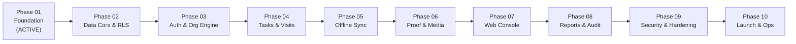

# FieldOps — 10-Phase Master Engineering Roadmap

---

## 1. Roadmap Architecture & Phase-Gate Governance

The FieldOps development lifecycle is governed by a strict **10-Phase Master Roadmap**. Progression across phases is strictly gated: no future-phase implementation work may begin until the active phase passes its formal validation review.

---

## 2. Phase-by-Phase Roadmap Specification

### Phase 01: Product, Brand & Foundation (CURRENT / ACTIVE)
- **Goal**: Establish the complete source of truth for the product: architecture principles, PRD, domain models, UX principles, design tokens, security rules, and QA strategy.
- **In-Scope Deliverables**: PRD, Personas, Roles & RBAC Matrix, V1 Scope, Non-Goals, User Stories, User Flows, Brand Strategy, Naming Discovery, Design Tokens, Component Inventory, Security Mandates, Testing Strategy, AGENTS.md, README.md, Phase 01 Validation Report.
- **Strictly Prohibited**: Writing Next.js/Flutter code, initializing live databases, running servers, installing application dependencies.
- **Exit Gate**: 100% documentation completeness, zero internal contradictions, formal validation report marked `PASS`.

---

### Phase 02: Architecture & Multi-Tenant Data Core
- **Goal**: Design and execute the PostgreSQL database schema, Row-Level Security (RLS) policies, database migration pipelines, and API contract specifications.
- **In-Scope Deliverables**: Version-controlled SQL migrations for all domain entities (`organizations`, `users`, `teams`, `locations`, `tasks`, `visits`, `attendance_records`, `proof_of_work`, `audit_logs`), RLS security policies, OpenAPI / TypeScript contract types, automated cross-tenant integration tests.
- **Exit Gate**: Automated RLS test suite demonstrating 100% zero data leakage across test tenants.

---

### Phase 03: Auth, Identity & Organization Engine
- **Goal**: Implement multi-tenant authentication, session lifecycle, JWT verification, and organization/member onboarding.
- **In-Scope Deliverables**: User registration, magic links / password auth, tenant subdomain routing, role assignment logic, member invitation flow, server-side RBAC middleware.
- **Exit Gate**: Complete authentication cycle verified across all five roles (`Owner`, `Admin`, `Manager`, `Supervisor`, `Field Worker`).

---

### Phase 04: Task & Visit Management Core
- **Goal**: Build the core operational engine managing task dispatch, status state machines, checklist evaluation, and visit scheduling.
- **In-Scope Deliverables**: Task CRUD API, state machine validation middleware (`DRAFT` $\rightarrow$ `COMPLETED`), checklist evaluation logic, visit scheduling engine, Haversine geofence calculation module.
- **Exit Gate**: State machine unit tests achieving 100% branch coverage; illegal state transitions strictly blocked with HTTP 422.

---

### Phase 05: Offline Mobile Engine & Synchronization Protocol
- **Goal**: Build the mobile foundation (Android & iOS) with an embedded local database and the offline mutation queue protocol.
- **In-Scope Deliverables**: Mobile project initialization, local SQLite database layer, optimistic UI store, idempotent mutation queue, background sync engine, delta sync API endpoint.
- **Exit Gate**: Successful verification of offline task execution and subsequent background sync under simulated Airplane Mode without data duplication.

---

### Phase 06: Proof-of-Work & Media Pipeline
- **Goal**: Implement tamper-evident proof capture on mobile and the authorized cloud media storage pipeline.
- **In-Scope Deliverables**: In-app camera interface, EXIF metadata extraction, automated timestamp/GPS watermarking, vector signature pad on glass, pre-signed S3 upload/download pipeline.
- **Exit Gate**: Verified tamper-proof photo upload and storage isolation; unauthorized cross-tenant media access blocked.

---

### Phase 07: Web Dispatch & Management Console
- **Goal**: Build the web management interface for dispatchers, supervisors, and operations managers.
- **In-Scope Deliverables**: Responsive web portal, Operational Dashboard KPI widgets, Task Kanban and List views, Calendar Dispatcher schedule board, Live Operational Map (Mapbox/Leaflet) with exception tagging.
- **Exit Gate**: Real-time dispatch workflows validated across desktop and tablet viewports; performance budget ($< 1.2\text{s}$ first usable paint) met.

---

### Phase 08: Reporting, Analytics & Audit Console
- **Goal**: Deliver management reporting, SLA performance analytics, and compliance audit trail viewing.
- **In-Scope Deliverables**: Attendance shift report, task turnaround SLA analytics, visit verification exception report, team performance comparison, CSV/PDF export engine, immutable audit log viewer.
- **Exit Gate**: Export pipeline verified; audit log viewer reflecting all sensitive overrides and status changes.

---

### Phase 09: End-to-End Hardening & Security Audit
- **Goal**: Conduct rigorous security penetration testing, chaos testing, performance benchmarking, and battery consumption audits.
- **In-Scope Deliverables**: Dynamic security testing (DAST), battery drain optimization on mobile devices ($\le 3.5\%$ per 8-hr shift), high-load stress testing (1,000 concurrent sync mutations), accessibility compliance audit (WCAG 2.1 AA).
- **Exit Gate**: Zero open high/critical security vulnerabilities; battery and memory budgets confirmed on physical test devices.

---

### Phase 10: Production Readiness & Commercial Launch
- **Goal**: Provision production cloud infrastructure, observability telemetry, CI/CD deployment pipelines, and SaaS billing integration.
- **In-Scope Deliverables**: Multi-region production infrastructure, automated database backup and disaster recovery runbooks, Datadog/Sentry observability alerting, Stripe subscription billing integration, public launch readiness.
- **Exit Gate**: Formal production sign-off; SLA monitoring active; successful dry-run recovery drill.
