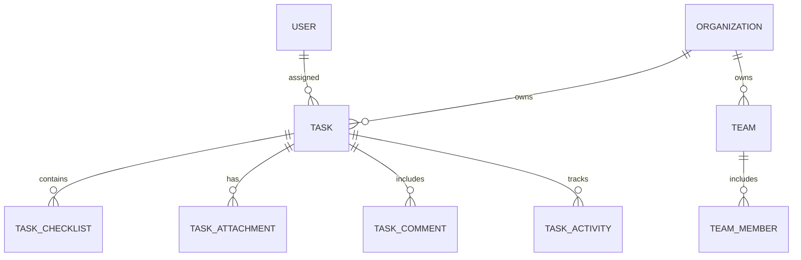

# Task Domain Model & Specification

## 1. Executive Summary

The FieldOps Task Management Engine forms the operational core for dispatching work, enforcing quality verification checklists, managing team workloads, and recording chronological activity. It bridges administrative dispatching with technician fieldwork.

---

## 2. Core Entities

### 2.1 Task Entity
- **ID (`id`)**: Primary UUIDv7 identifier.
- **Organization ID (`organization_id`)**: Partitioning key for strict multi-tenant isolation.
- **Title (`title`)**: String (3-255 characters). Clear description of operational job.
- **Description (`description`)**: Detailed operational steps, hazards, site access codes.
- **Status (`status`)**: Finite state machine state (`DRAFT`, `ASSIGNED`, `ACCEPTED`, `IN_PROGRESS`, `BLOCKED`, `COMPLETED`, `CANCELED`).
- **Priority (`priority`)**: `LOW`, `MEDIUM`, `HIGH`, `URGENT`.
- **Created By (`created_by`)**: User ID of creator.
- **Assigned To (`assigned_to`)**: User ID of assigned field technician (optional if assigned to team).
- **Assigned Team (`assigned_team`)**: Team ID (optional if assigned directly to user).
- **Due Date (`due_at`)**: UTC timestamp for SLA and overdue monitoring.
- **Blocked Reason (`blocked_reason`)**: Mandatory reason text when transitioning to `BLOCKED`.
- **Version (`version`)**: Integer incremented on every state transition and update, enforcing server-authoritative optimistic concurrency control.

### 2.2 Task Checklist Entity (`task_checklists`)
- **Position (`position`)**: Ordering integer within the task checklist.
- **Title (`title`)**: Actionable verification step.
- **Is Required (`is_required`)**: Boolean flag. If `true`, the task lifecycle strictly blocks completion until this item is completed.
- **Is Completed (`is_completed`)**: Boolean completion flag.
- **Completed At / By**: Audit fields tracking when and who completed the verification.

### 2.3 Task Attachments (`task_attachments`)
- Metadata records representing operational photos, schematics, manuals, or documents stored in Supabase Storage.
- Enforces strict MIME whitelist (`image/jpeg`, `image/png`, `application/pdf`, etc.) and 25MB maximum size.

### 2.4 Task Comments (`task_comments`)
- Chronological discussion thread between office dispatchers, supervisors, and field technicians.

### 2.5 Task Activities (`task_activities`)
- Append-only immutable log of state changes, assignments, checklist events, and comments.
- Direct UPDATE and DELETE operations are permanently blocked by database trigger.
