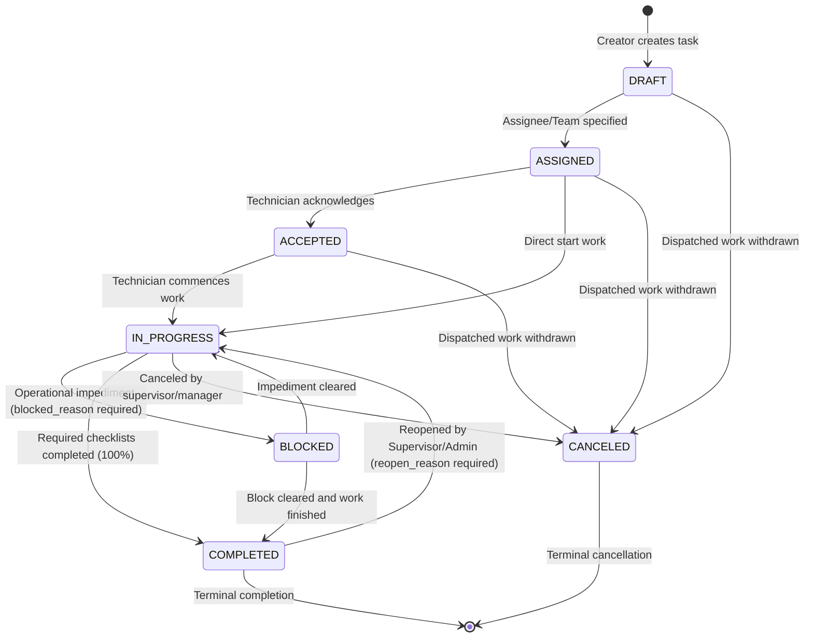

# Task Lifecycle & State Machine Specification

## 1. Overview

The Task Lifecycle in FieldOps is governed by a deterministic, server-enforced finite state machine. Transitions are validated across all layers: TypeScript runtime (`isValidTaskTransition`), Dart mobile client (`isValidTaskTransition`), and PostgreSQL stored procedures (`transition_task_status`).

---

## 2. State Machine Diagram

---

## 3. Transition Rules & Preconditions

| From Status | To Status | Authorized Roles | Preconditions & Validation Rules |
| :--- | :--- | :--- | :--- |
| `DRAFT` | `ASSIGNED` | Owner, Admin, Manager, Supervisor | Must specify `assigned_to` or `assigned_team`. |
| `DRAFT` | `CANCELED` | Owner, Admin, Manager, Supervisor | Field Workers cannot cancel tasks. |
| `ASSIGNED` | `ACCEPTED` | Assignee, Supervisor, Manager, Admin | Acknowledges task receipt in mobile app. |
| `ASSIGNED` | `IN_PROGRESS` | Assignee, Supervisor, Manager, Admin | Technicians may jump directly to work. |
| `ACCEPTED` | `IN_PROGRESS` | Assignee, Supervisor, Manager, Admin | Technician commences on-site execution. |
| `IN_PROGRESS` | `BLOCKED` | Assignee, Supervisor, Manager, Admin | **Mandatory** non-empty `blocked_reason` explaining blocker. |
| `BLOCKED` | `IN_PROGRESS` | Assignee, Supervisor, Manager, Admin | Resume work once obstruction is cleared. |
| `IN_PROGRESS` | `COMPLETED` | Assignee, Supervisor, Manager, Admin | **Mandatory**: All `is_required = true` checklist items must be completed. |
| `BLOCKED` | `COMPLETED` | Assignee, Supervisor, Manager, Admin | Same checklist completion rule applies. |
| `COMPLETED` | `IN_PROGRESS` | Owner, Admin, Manager, Supervisor | **Field Workers forbidden from reopening**. Requires `reopen_reason`. |
| Any (except CANCELED) | `CANCELED` | Owner, Admin, Manager, Supervisor | `CANCELED` is terminal. Field Workers cannot cancel. |

---

## 4. Forbidden Transitions

1. **Direct `DRAFT` to `COMPLETED`**: Strictly prohibited. Work must be assigned and executed.
2. **Transitions out of `CANCELED`**: `CANCELED` is an immutable terminal state.
3. **Completion with Incomplete Required Checklists**: Returns `TASK_CHECKLIST_INCOMPLETE` error code.
4. **Reopening by Field Worker**: Returns `TASK_ACCESS_DENIED`. Reopening requires administrative or supervisory review.
