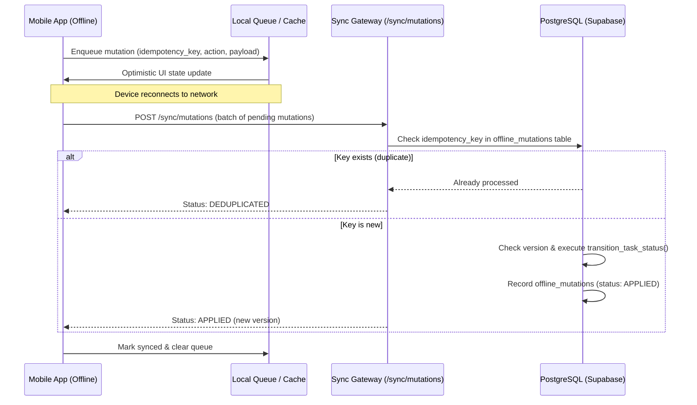

# Offline Task Engine & Synchronization Architecture

## 1. Executive Summary

Field forces regularly operate in basements, rural sites, industrial facilities, and elevators with intermittent or zero cellular connectivity. The FieldOps mobile application implements an offline-first architecture ensuring that:
1. Technicians can view tasks, execute verification checklists, and update task statuses without network access.
2. All local mutations are durable, queued with cryptographically random idempotency keys.
3. Upon network reconnection, queued mutations sync automatically and idempotently.

---

## 2. Mutation Lifecycle

---

## 3. Idempotency Guarantees

Every client mutation generates:
- `mutationId`: UUID tracking the mutation instance.
- `idempotencyKey`: Unique string composed of `idem_${userId}_${entityId}_${action}_${timestampMs}`.

The database `offline_mutations` table maintains a `UNIQUE (tenant_id, idempotency_key)` constraint. If network retry or client reconnect causes duplicate delivery, the server returns status `DEDUPLICATED` without executing side effects twice.
