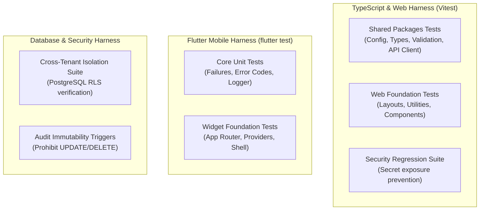

# FieldOps — Testing Architecture & Quality Model

---

## 1. Testing Architecture Overview

Testing in FieldOps verifies functionality across nine distinct quality dimensions: Functional, Security, Tenant Isolation, UX, Accessibility, Reliability (Offline), Mobile Lifecycle, Data Integrity, and Observability.

---

## 2. Test Execution Harnesses

---

## 3. Test Suites Inventory

1. **`packages/config/tests/config.test.ts`**: Verifies client and server configuration validation, fail-fast missing variable detection, and browser context protections.
2. **`packages/validation/tests/validation.test.ts`**: Verifies UUID format parsing, ISO-8601 timestamp parsing, API error envelope contracts, and pagination schemas.
3. **`packages/api/tests/api-client.test.ts`**: Verifies request ID injection, authentication headers, error normalization, and exponential backoff retry policies.
4. **`tests/security/secret-exposure.test.ts`**: Verifies zero secret patterns exist in client packages and no `.env` files are tracked by Git.
5. **`apps/web/tests/unit/smoke.test.ts`**: Verifies CSS class utility merging and web API client initialization.
6. **`apps/mobile/test/core/failures_test.dart`**: Verifies mobile failure domain models and error code mappings.
7. **`apps/mobile/test/widget_test.dart`**: Verifies Flutter mobile app root widget mounting and foundation shell rendering.
