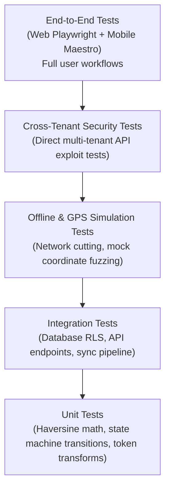

# FieldOps — Quality Assurance & Testing Strategy

---

## 1. Testing Philosophy

In a mission-critical field operations platform, software bugs translate directly into physical world chaos: technicians dispatched to incorrect sites, disputed wage payments, and lost proof of completed repairs. 

Testing in FieldOps is not a post-development chore. It is an automated, continuous verification harness that guards system correctness, multi-tenant isolation, and offline durability.

> [!WARNING]
> **Mandatory Rule from AGENTS.md**:
> - Rule 9: *Every feature requires tests.*
> - Rule 10: *Never delete tests to make CI pass.*
> - Rule 11: *Never weaken security to solve a test failure.*

---

## 2. The Nine-Dimension Quality Model

Every major feature and pull request across all phases must satisfy verification across nine distinct quality dimensions:

| Dimension | Core Verification Question | Verification Method |
| :--- | :--- | :--- |
| **1. Functional** | Does the feature satisfy the functional PRD specifications and state machine rules? | Unit tests, Integration tests, End-to-End browser/mobile tests. |
| **2. Security** | Can an unauthenticated or unauthorized user access or manipulate protected endpoints? | Server-side RBAC test suites, JWT expiration tests, penetration tests. |
| **3. Tenant Isolation** | Can Tenant A query, mutate, or observe any data belonging to Tenant B? | Automated cross-tenant test suites targeting DB queries, APIs, and S3 paths. |
| **4. UX & Usability** | Can the user complete the workflow with minimal cognitive friction and zero dead ends? | Usability testing, workflow completion audits, empty state verification. |
| **5. Accessibility** | Can the software be operated by individuals with visual impairments or using screen readers? | Automated Axe/Lighthouse accessibility audits, contrast analysis, keyboard navigation tests. |
| **6. Reliability (Offline)**| What happens when cellular network connectivity fails abruptly or is unavailable? | Network cutoff simulation, Airplane Mode test harnesses, sync queue replay tests. |
| **7. Mobile Lifecycle** | What happens when the app is backgrounded, interrupted by phone calls, or killed by OS low-memory killer? | Mobile state restoration tests, durable local transaction tests, lifecycle observers. |
| **8. Data Integrity** | Can operations be duplicated, lost, or corrupted by concurrent requests? | Idempotency replay tests, race condition fuzzing, transaction rollback verification. |
| **9. Observability** | Can production failures, sync bottlenecks, and exceptions be diagnosed in telemetry? | Structured JSON logging assertions, distributed tracing span checks, audit log verification. |

---

## 3. Test Pyramid & Execution Strategy

### 3.1. Unit Testing
- **Focus**: Pure business logic, state machine validators, Haversine distance math, token parsing, date calculations.
- **Requirement**: 100% branch coverage on core state machines (`TaskStatus`, `VisitStatus`, `AttendanceStatus`).
- **Speed**: Must execute within $< 5\text{ seconds}$ locally.

### 3.2. Integration & Database RLS Testing
- **Focus**: PostgreSQL RLS policy verification, database migrations, service-layer transactions.
- **Harness**: Real temporary PostgreSQL instances (via Docker / Testcontainers).
- **Rule**: Every database query must be verified with both matching tenant context and mismatched tenant context.

### 3.3. Offline & Sync Simulation Testing
- **Focus**: Local SQLite mutation queue, network loss simulation, idempotency deduplication.
- **Harness**: Mobile integration harness that simulates:
  1. Enqueuing 10 mutations while network is mocked as unreachable.
  2. Killing the process abruptly.
  3. Restarting process $\rightarrow$ verifying all 10 mutations remain intact.
  4. Restoring network $\rightarrow$ verifying exactly 10 mutations are processed with zero duplicates.

### 3.4. GPS & Geofence Mock Testing
- **Focus**: Haversine distance evaluation, accuracy filtering, exception handling.
- **Harness**: Parametric test fixtures with coordinates:
  - Exact site coordinates $\rightarrow$ distance 0m $\rightarrow$ `VALID`.
  - Coordinate 45m away (radius 100m) $\rightarrow$ `VALID`.
  - Coordinate 105m away (radius 100m) $\rightarrow$ `LOCATION_EXCEPTION`.
  - Poor GPS accuracy ($acc = 85\text{m}$) $\rightarrow$ triggers retry/warning logic.

### 3.5. Automated Cross-Tenant Security Suite
- A dedicated test runner initialized with two distinct organizations:
  - `Tenant Alpha` (User: `alpha_worker`, `alpha_manager`)
  - `Tenant Beta` (User: `beta_worker`, `beta_manager`)
- Matrix execution: `alpha_worker` attempts to GET/POST/PUT/DELETE every resource ID created by `Tenant Beta`.
- **Pass Requirement**: 100% of cross-tenant attempts must return `404 Not Found` or `403 Forbidden` with zero data leakage.

---

## 4. CI/CD Quality Gates

Every pull request must pass all automated gates prior to merge:
1. **Linter & Typecheck**: Zero TypeScript / Dart / Kotlin lint warnings.
2. **Unit & Integration Suite**: All unit and RLS integration tests passing.
3. **Cross-Tenant Test Suite**: 100% pass on cross-tenant isolation matrix.
4. **Security Scan**: Static analysis (SAST) and dependency vulnerability check (zero high/critical CVEs).
5. **Coverage Budget**: Minimum 85% statement coverage on backend domain services and sync engine.
