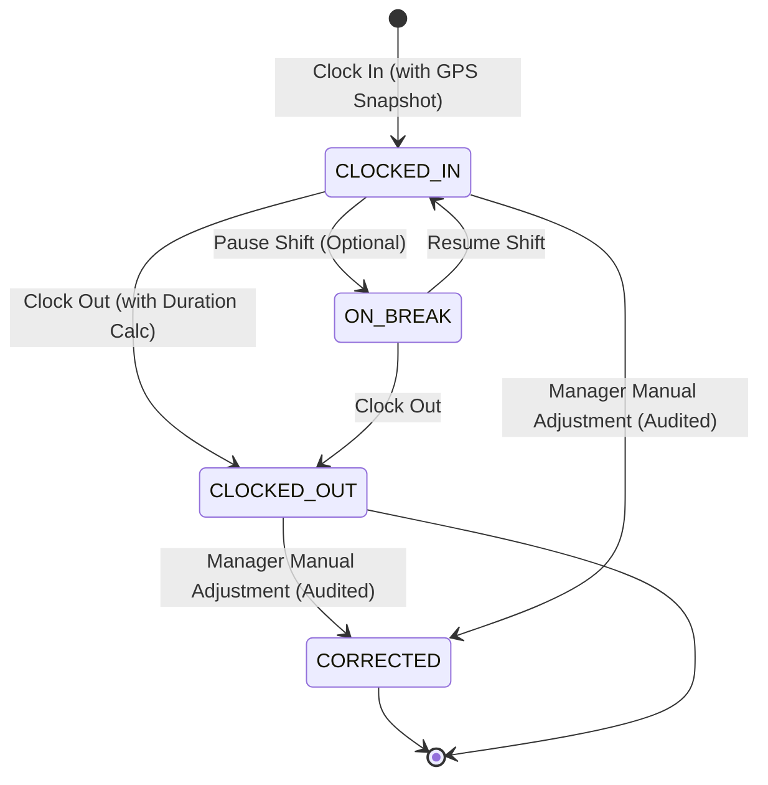

# Shift Lifecycle State Machine

## 1. State Diagram

## 2. Transition Rules

| Initial Status | Target Status | Permitted Roles | Conditions / Invariants |
| :--- | :--- | :--- | :--- |
| `[None]` | `CLOCKED_IN` | All Roles | No other active shift for user in organization. Coordinates within valid bounds. |
| `CLOCKED_IN` | `ON_BREAK` | Field Worker, Supervisor | Shift must be active. |
| `ON_BREAK` | `CLOCKED_IN` | Field Worker, Supervisor | Resumes active duty timer. |
| `CLOCKED_IN` / `ON_BREAK` | `CLOCKED_OUT` | Field Worker, Supervisor | Check-out timestamp $\ge$ check-in timestamp. Computes `duration_seconds`. Warns if tasks/visits in progress. |
| Any Status | `CORRECTED` | Manager, Admin, Owner | Justification $\ge$ 10 chars. Writes immutable audit log and updates `worker_activities`. |

## 3. Duplicate Shift Prevention

PostgreSQL stored procedure `record_attendance_checkin` queries existing records for `(organization_id, user_id)` where `status IN ('CLOCKED_IN', 'CHECKED_IN')`. If found, the transaction raises an exception preventing concurrent open shifts.
